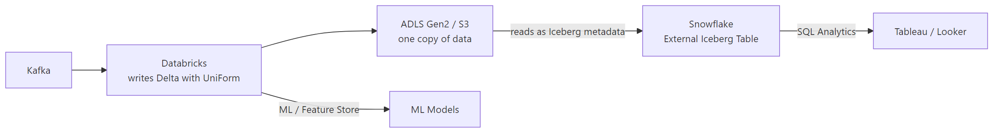

# Databricks + Snowflake Together

## What problem does this solve?
Databricks excels at ML and large-scale Spark processing. Snowflake excels at governed SQL analytics and data sharing. Most enterprises use both. The question is: how do you avoid duplicating data between them?

## Architecture patterns

### Pattern 1: Delta UniForm (recommended for new builds)



Zero data duplication. Databricks writes, Snowflake reads. Works on Azure (ADLS) and AWS (S3).

### Pattern 2: Databricks → Snowflake via COPY (bulk load)

```python
# Write to Parquet on S3/ADLS, then COPY INTO Snowflake
gold_df.write \
    .format("parquet") \
    .mode("overwrite") \
    .save("s3://my-bucket/staging/fact_orders/")

# Then in Airflow or Databricks:
import snowflake.connector
conn = snowflake.connector.connect(**snowflake_config)
conn.cursor().execute("""
    COPY INTO prod.sales.fact_orders
    FROM @my_s3_stage/staging/fact_orders/
    FILE_FORMAT=(TYPE='PARQUET')
    MATCH_BY_COLUMN_NAME=CASE_INSENSITIVE
    PURGE=TRUE;
""")
```

### Pattern 3: Spark Snowflake Connector (push down to Snowflake)

```python
# Read from Snowflake into Spark
dim_customer = spark.read \
    .format("snowflake") \
    .options(**{
        "sfURL": "myacct.snowflakecomputing.com",
        "sfDatabase": "PROD",
        "sfSchema": "SALES",
        "sfWarehouse": "SPARK_WH",
        "dbtable": "DIM_CUSTOMER"
    }) \
    .load()

# Write Spark DataFrame to Snowflake
gold_df.write \
    .format("snowflake") \
    .options(**snowflake_options) \
    .option("dbtable", "FACT_ORDERS") \
    .mode("overwrite") \
    .save()
```

## When to use which pattern

| Pattern | Best for | Latency | Cost |
|---------|---------|---------|------|
| Delta UniForm | Greenfield, ADLS/S3 | Near-realtime | Lowest (no data copy) |
| COPY INTO | Bulk daily loads | Minutes | Low (staging cost only) |
| Spark connector | Hybrid queries, lookups | Minutes | Medium (Snowflake VWH) |

## Real-world scenario
Financial services: Databricks for fraud ML (needs Spark, Python, feature store), Snowflake for regulatory reporting (needs SQL, governed sharing with auditors). Before: two copies of transaction data ($40K/month storage duplication), daily sync job taking 3 hours. After Delta UniForm: one copy, Snowflake reads Iceberg metadata from same ADLS files Databricks writes. Storage cost halved, Snowflake always in sync with Databricks within minutes.

## What goes wrong in production
- **UniForm + schema evolution** — adding columns to a UniForm-enabled Delta table requires Snowflake to refresh the external table definition: `ALTER ICEBERG TABLE sf_fact_orders REFRESH`. Automate this.
- **Spark connector using wrong warehouse** — Spark connector uses a Snowflake virtual warehouse that stays running during the read/write. Auto-suspend = 60s minimum. Use a dedicated `SPARK_WH` warehouse.

## References
- [Delta UniForm Documentation](https://docs.databricks.com/en/delta/uniform.html)
- [Snowflake External Iceberg Tables](https://docs.snowflake.com/en/user-guide/tables-iceberg)
- [Spark Snowflake Connector](https://docs.snowflake.com/en/user-guide/spark-connector)
