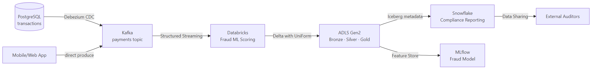

# Scenario: Fintech Payment Pipeline

## Overview
Real-time payment processing pipeline: Kafka → Databricks fraud scoring → Delta Lake → Snowflake compliance reporting.

**Stack**: Kafka · Databricks Structured Streaming · Delta Lake · Delta UniForm · Snowflake · Airflow · dbt · Unity Catalog

## Architecture

## Pipeline Stages

### Stage 1: Ingestion (Bronze)
- Source: Kafka topic `payments` (200K events/sec peak)
- Schema: Avro with Schema Registry
- Databricks Structured Streaming → Bronze Delta table
- DLT Expectation: `@expect("valid_payment_id", "payment_id IS NOT NULL")`

### Stage 2: Enrichment + Fraud Scoring (Silver)
- Join payment with customer profile (Delta table)
- Apply ML model (MLflow) to score fraud probability
- DLT Expectation: `@expect_or_drop("positive_amount", "amount > 0")`
- Mask PAN: `CONCAT('****-****-****-', RIGHT(card_number, 4))`
- SCD Type 2 on customer dimension

### Stage 3: Serving (Gold)
- `fact_payments`: one row per payment, fraud score, masked PAN
- `dim_merchant`: merchant attributes
- `fact_daily_fraud_summary`: aggregated for compliance
- dbt models: `mart_compliance_report`, `mart_fraud_metrics`

### Stage 4: Snowflake Compliance Layer
- Snowflake reads Gold tables as External Iceberg Tables (zero copy)
- Row access policy: auditors see only transactions, not PAN even before masking
- Snowflake Data Sharing: auditor organisations get read-only access
- Nightly: `CALL refresh_compliance_views('{{ ds }}')`

## SLAs

| Stage | Target Latency | Alerting |
|-------|---------------|---------|
| Kafka → Bronze | < 30 seconds | PagerDuty P1 |
| Bronze → Silver (fraud score) | < 2 minutes | PagerDuty P1 |
| Silver → Gold | < 10 minutes | PagerDuty P2 |
| Gold → Snowflake | < 30 minutes | PagerDuty P2 |
| Compliance report available | 06:00 daily | Email P3 |

## Key Design Decisions

1. **Why DLT for Bronze→Silver?** — DLT Expectations quarantine invalid payments automatically, event log provides quality audit trail required for PCI-DSS.
2. **Why Delta UniForm for Snowflake?** — Zero data duplication, one copy of truth, no sync lag between Databricks and Snowflake.
3. **Why mask PAN in Silver not Gold?** — Masking as early as possible limits PCI-DSS scope to Bronze only. Silver and Gold are out of PCI scope.
4. **Why Snowflake Data Sharing (not ETL)?** — Auditors get live read access to a governed share. No data movement to their environment. Revocable instantly.

## References
- [Databricks DLT](https://docs.databricks.com/en/delta-live-tables/index.html)
- [Delta UniForm](https://docs.databricks.com/en/delta/uniform.html)
- [Snowflake Data Sharing](https://docs.snowflake.com/en/user-guide/data-sharing-intro)
- [Snowflake PCI-DSS Compliance](https://www.snowflake.com/blog/snowflake-achieves-pci-dss-compliance/)
