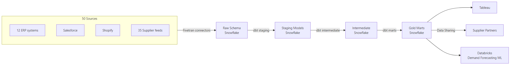

# Scenario: Retail Lakehouse (50 Sources)

## Overview
Modern ELT data platform ingesting from 50 sources into a Snowflake-centric lakehouse, serving merchandising analytics and data marketplace.

**Stack**: Fivetran · ADLS Gen2 · Databricks (Silver transforms) · dbt · Snowflake · Airflow · DataHub

## Architecture



## Key components

### Ingestion: Fivetran
- 50 connectors managed in Fivetran
- Auto-schema migration handles source schema changes
- Lands raw data in Snowflake `raw` database, schema per source
- Sync frequency: hourly for transactions, daily for supplier feeds

### Transformation: dbt on Snowflake
```
models/
├── staging/           ← 50 source-specific staging models
│   ├── erp_1/
│   ├── salesforce/
│   └── shopify/
├── intermediate/      ← cross-source joins, dedup logic
│   ├── int_orders_unified.sql     ← unifies 12 ERP order schemas
│   └── int_inventory_unified.sql
└── marts/
    ├── merchandising/
    │   ├── fact_sales.sql
    │   ├── dim_product.sql
    │   └── dim_store.sql
    └── supplier/
        └── fact_supplier_performance.sql
```

### Orchestration: Airflow on MWAA/Cloud Composer
- DAG: `retail_daily_pipeline` — triggers at 01:00 UTC
- Tasks: `fivetran_sync` → `dbt_run` → `snowflake_refresh` → `notify`
- SLA: all marts available by 06:00 local time for morning trading reports

### Data Sharing: Snowflake Marketplace
- Suppliers get read access to their own performance data via Snowflake Shares
- No data movement to supplier systems
- Access revoked automatically on contract end

## SLAs

| Data | Available by | Owner |
|------|-------------|-------|
| Yesterday's sales | 06:00 | Platform team |
| Inventory positions | 08:00 | Supply chain team |
| Supplier performance | 08:00 | Procurement team |
| Forecast refresh | 10:00 | Data science team |

## References
- [Fivetran Documentation](https://fivetran.com/docs)
- [dbt Project Structure](https://docs.getdbt.com/best-practices/how-we-structure/1-guide-overview)
- [Snowflake Data Sharing](https://docs.snowflake.com/en/user-guide/data-sharing-intro)
- [Amazon MWAA](https://docs.aws.amazon.com/mwaa/)
