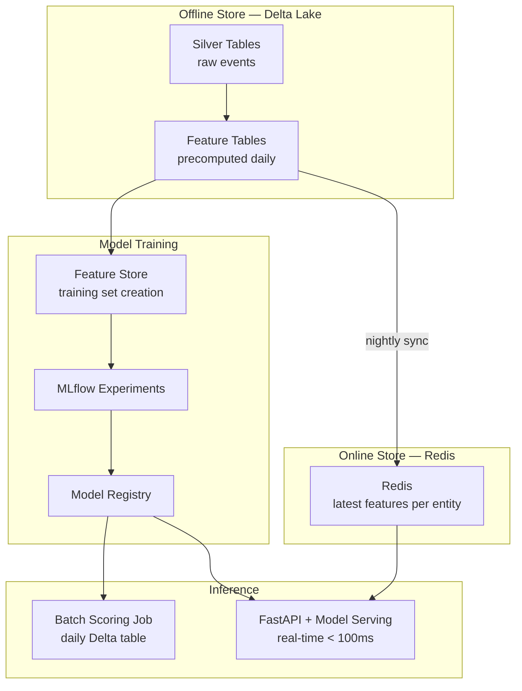

# Scenario: ML Feature Platform

## Overview
End-to-end ML feature platform serving both real-time (< 100ms) and batch inference using Databricks Feature Store, Delta Lake, and a low-latency online store.

**Stack**: Databricks · Delta Lake · Feature Store · MLflow · Redis (online store) · FastAPI · Kafka

## Architecture



## Feature Engineering

```python
from databricks.feature_store import FeatureStoreClient
import pyspark.sql.functions as F

fs = FeatureStoreClient()

# Compute customer features (run nightly)
customer_features = spark.table("silver.transactions") \
    .filter(F.col("tx_date") >= F.date_sub(F.current_date(), 90)) \
    .groupBy("customer_id") \
    .agg(
        F.count("tx_id").alias("tx_count_90d"),
        F.sum("amount").alias("total_spend_90d"),
        F.avg("amount").alias("avg_tx_amount"),
        F.stddev("amount").alias("stddev_tx_amount"),
        F.countDistinct("merchant_id").alias("unique_merchants_90d"),
        F.max("tx_date").alias("last_tx_date"),
        F.datediff(F.current_date(), F.max("tx_date")).alias("days_since_last_tx")
    )

# Write to Feature Store
fs.write_table(
    name="prod.feature_store.customer_features",
    df=customer_features,
    mode="merge"
)

# Sync latest features to Redis for real-time serving
# (run after feature computation)
latest_features = spark.table("prod.feature_store.customer_features")
redis_records = latest_features.collect()

import redis
r = redis.Redis(host="redis-host", port=6379)
for row in redis_records:
    r.hset(f"customer:{row.customer_id}", mapping={
        "tx_count_90d": row.tx_count_90d,
        "avg_tx_amount": float(row.avg_tx_amount),
        "days_since_last_tx": row.days_since_last_tx
    })
    r.expire(f"customer:{row.customer_id}", 86400 * 2)  # 2-day TTL
```

## Real-Time Inference (FastAPI)

```python
from fastapi import FastAPI
import mlflow.sklearn
import redis
import numpy as np

app = FastAPI()

# Load model once at startup
model = mlflow.sklearn.load_model("models:/fraud-detector/Production")
r = redis.Redis(host="redis-host", port=6379)

@app.post("/score")
async def score_transaction(customer_id: str, amount: float, merchant_category: str):
    # Fetch features from Redis (< 1ms)
    features_raw = r.hgetall(f"customer:{customer_id}")

    if not features_raw:
        # Cold start: use default features
        features = [amount, 0, 0, 0, 0]
    else:
        features = [
            amount,
            float(features_raw[b"tx_count_90d"]),
            float(features_raw[b"avg_tx_amount"]),
            float(features_raw[b"days_since_last_tx"]),
            hash(merchant_category) % 100  # category encoding
        ]

    fraud_probability = model.predict_proba([features])[0][1]

    return {
        "customer_id": customer_id,
        "fraud_probability": round(float(fraud_probability), 4),
        "decision": "BLOCK" if fraud_probability > 0.85 else "ALLOW"
    }
```

## SLAs

| Component | Target | Alert |
|---|---|---|
| Feature computation (nightly) | Complete by 02:00 | PagerDuty P2 |
| Redis sync | Complete by 02:30 | PagerDuty P2 |
| Real-time inference | < 100ms p99 | PagerDuty P1 |
| Batch scoring | Complete by 06:00 | PagerDuty P2 |
| Model retraining | Monthly or on drift | Slack notification |

## References
- [Databricks Feature Store](https://docs.databricks.com/en/machine-learning/feature-store/index.html)
- [MLflow Model Serving](https://docs.databricks.com/en/machine-learning/model-serving/index.html)
- [Redis as Feature Store](https://redis.com/solutions/use-cases/feature-store/)
