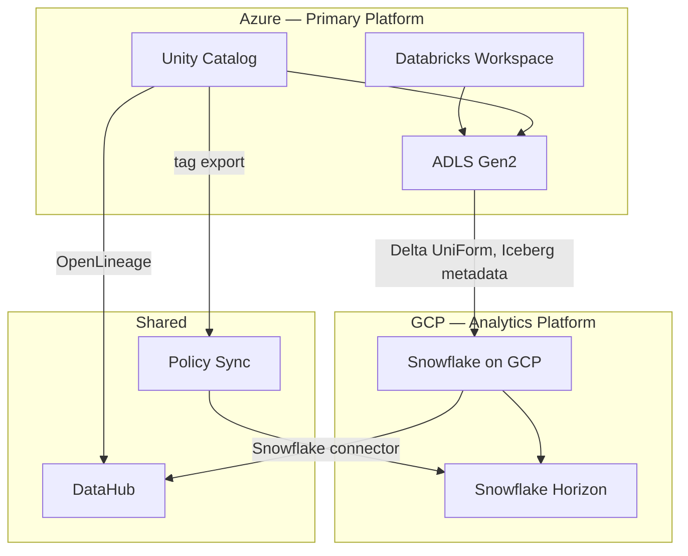

# Scenario: Multi-Cloud Governance

## Overview
Enterprise running Databricks on Azure (primary) + Snowflake on GCP (analytics) with a unified governance layer using Unity Catalog and Snowflake Horizon.

**Stack**: Azure Databricks · ADLS Gen2 · Unity Catalog · Delta UniForm · Snowflake on GCP · Snowflake Horizon · DataHub

## Architecture



| Node | Details |
|------|---------|
| **Unity Catalog** | primary governance |
| **ADLS Gen2** | Delta Lake |
| **Snowflake on GCP** | SQL analytics + BI |
| **Snowflake Horizon** | masking + row filters |
| **DataHub** | unified catalogue + lineage |
| **Policy Sync** | UC tags → SF tags |

## Governance Alignment Pattern

### Step 1: Tag tables in Unity Catalog

```sql
-- Unity Catalog: classify tables
CREATE TAG IF NOT EXISTS data_classification
    ALLOWED_VALUES 'PUBLIC', 'INTERNAL', 'CONFIDENTIAL', 'RESTRICTED';
CREATE TAG IF NOT EXISTS pii_type
    ALLOWED_VALUES 'name', 'email', 'phone', 'financial';

ALTER TABLE prod.silver.customers
    SET TAG data_classification = 'CONFIDENTIAL';
ALTER TABLE prod.silver.customers
    MODIFY COLUMN email SET TAG pii_type = 'email';
```

### Step 2: Replicate policies to Snowflake

```python
# Policy sync job: read UC tags → apply equivalent Snowflake policies
from databricks.sdk import WorkspaceClient

w = WorkspaceClient()

# Get all columns tagged as PII in UC
pii_columns = w.tables.list_tags(full_name="prod.silver.customers")
# Returns: [{"column": "email", "tags": {"pii_type": "email"}}, ...]

# Apply equivalent masking policy in Snowflake
import snowflake.connector
conn = snowflake.connector.connect(...)
cur = conn.cursor()

for col in pii_columns:
    if col["tags"].get("pii_type") == "email":
        cur.execute(f"""
            ALTER TABLE prod.silver.customers
            MODIFY COLUMN {col["column"]} SET MASKING POLICY mask_email
        """)
```

### Step 3: Zero-copy sharing via Delta UniForm

```sql
-- Enable UniForm on Delta tables (Databricks side)
ALTER TABLE prod.gold.fact_orders
    SET TBLPROPERTIES ('delta.universalFormat.enabledFormats' = 'iceberg');

-- Snowflake: read Delta table as Iceberg (no data copy)
CREATE ICEBERG TABLE sf_fact_orders
    EXTERNAL_VOLUME = 'my_adls_volume'
    CATALOG = 'GLUE'
    BASE_LOCATION = 'gold/fact_orders/';

-- Apply Snowflake row access policy (same rules as UC row filter)
ALTER TABLE sf_fact_orders
    ADD ROW ACCESS POLICY region_access ON (ship_region);
```

## What goes wrong in production

- **Policy drift** — UC masking policies updated but Snowflake policies not synced. Schedule policy sync daily.
- **UniForm metadata lag** — UniForm generates Iceberg metadata asynchronously. Snowflake may see stale data for a few minutes after a Delta commit. For SLA-sensitive BI, add a freshness check.
- **Lineage gap at the UniForm boundary** — DataHub sees lineage within Databricks and within Snowflake separately but not across the UniForm bridge. Add a custom lineage edge via DataHub API.

## References
- [Delta UniForm](https://docs.databricks.com/en/delta/uniform.html)
- [Unity Catalog Object Tags](https://docs.databricks.com/en/data-governance/unity-catalog/tags.html)
- [Snowflake Horizon](https://docs.snowflake.com/en/guides-overview-govern)
