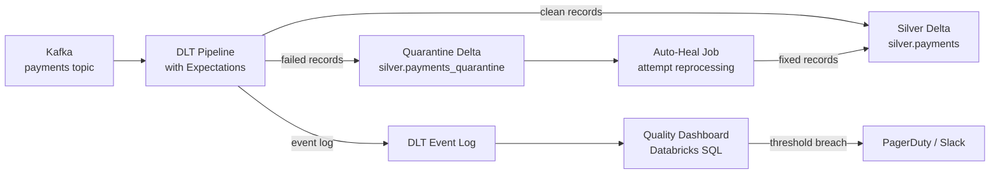

# Scenario: Streaming Quality Pipeline

## Overview
Real-time data quality monitoring for a streaming payments pipeline — detect bad data as it flows, quarantine it, alert on threshold breaches, and auto-heal where possible.

**Stack**: Kafka · Databricks Structured Streaming · DLT Expectations · Delta Lake · Databricks SQL Alerts · PagerDuty

## Architecture



## DLT Pipeline with Quality Expectations

```python
import dlt
from pyspark.sql import functions as F
from pyspark.sql.types import *

payment_schema = StructType([
    StructField("payment_id", StringType()),
    StructField("amount", DoubleType()),
    StructField("currency", StringType()),
    StructField("merchant_id", StringType()),
    StructField("customer_id", StringType()),
    StructField("event_ts", TimestampType()),
    StructField("status", StringType())
])

@dlt.table(name="bronze_payments", comment="Raw from Kafka — all records")
@dlt.expect("not_null_payment_id", "payment_id IS NOT NULL")
@dlt.expect("valid_amount_range", "amount BETWEEN 0.01 AND 1000000")
def bronze_payments():
    return spark.readStream.format("kafka") \
        .option("kafka.bootstrap.servers", "broker:9092") \
        .option("subscribe", "payments") \
        .option("maxOffsetsPerTrigger", "50000") \
        .load() \
        .select(F.from_json(F.col("value").cast("string"), payment_schema).alias("d")) \
        .select("d.*")

@dlt.table(name="silver_payments", comment="Validated payments — clean records only")
@dlt.expect_or_drop("not_null_id", "payment_id IS NOT NULL")
@dlt.expect_or_drop("positive_amount", "amount > 0")
@dlt.expect_or_drop("valid_currency", "currency IN ('USD','EUR','GBP','SGD','JPY','CNY')")
@dlt.expect_or_drop("valid_status", "status IN ('pending','completed','failed','refunded')")
@dlt.expect_or_drop("not_future_event", "event_ts <= current_timestamp()")
def silver_payments():
    return dlt.read_stream("bronze_payments")

@dlt.table(name="silver_payments_quarantine", comment="Records failing quality checks")
def silver_payments_quarantine():
    return dlt.read_stream("bronze_payments").filter(
        "payment_id IS NULL OR amount <= 0 OR "
        "currency NOT IN ('USD','EUR','GBP','SGD','JPY','CNY') OR "
        "status NOT IN ('pending','completed','failed','refunded')"
    ).withColumn("quarantine_ts", F.current_timestamp()) \
     .withColumn("quarantine_reason",
        F.when(F.col("payment_id").isNull(), "null_payment_id")
        .when(F.col("amount") <= 0, "non_positive_amount")
        .when(~F.col("currency").isin("USD","EUR","GBP","SGD","JPY","CNY"), "invalid_currency")
        .otherwise("invalid_status"))
```

## Quality Monitoring Queries (Databricks SQL)

```sql
-- Real-time drop rate by expectation (last 1 hour)
SELECT
    timestamp,
    expectations.name AS expectation_name,
    expectations.dataset AS dataset,
    details:flow_progress:data_quality:dropped_records AS dropped,
    details:flow_progress:metrics:num_output_rows AS passed
FROM event_log("pipeline-id"),
LATERAL VIEW EXPLODE(details:flow_progress:data_quality:expectations) AS expectations
WHERE event_type = 'flow_progress'
  AND timestamp >= CURRENT_TIMESTAMP - INTERVAL 1 HOUR
ORDER BY timestamp DESC;

-- Alert query: drop rate > 1% in last 15 minutes → PagerDuty
SELECT
    ROUND(SUM(dropped) * 100.0 / (SUM(dropped) + SUM(passed)), 2) AS drop_rate_pct
FROM (
    SELECT
        details:flow_progress:data_quality:dropped_records AS dropped,
        details:flow_progress:metrics:num_output_rows AS passed
    FROM event_log("pipeline-id")
    WHERE event_type = 'flow_progress'
      AND timestamp >= CURRENT_TIMESTAMP - INTERVAL 15 MINUTES
)
HAVING drop_rate_pct > 1.0;
-- Set as Databricks SQL Alert: if result has rows → trigger notification
```

## Quarantine Auto-Heal

```python
# Auto-heal job: attempt to fix common quarantine issues and reprocess
def heal_quarantine(spark, batch_df, epoch_id):
    # Fix 1: normalise currency (e.g., "usd" → "USD")
    fixable = batch_df.filter("quarantine_reason = 'invalid_currency'") \
        .withColumn("currency", F.upper(F.col("currency")))

    still_invalid = fixable.filter(
        ~F.col("currency").isin("USD","EUR","GBP","SGD","JPY","CNY")
    )
    now_valid = fixable.filter(
        F.col("currency").isin("USD","EUR","GBP","SGD","JPY","CNY")
    ).drop("quarantine_ts", "quarantine_reason")

    # Reinsert healed records into Silver
    if not now_valid.isEmpty():
        now_valid.write.format("delta").mode("append").table("silver.payments")

    # Keep truly invalid records in quarantine for manual review
    if not still_invalid.isEmpty():
        still_invalid.withColumn("heal_attempted_ts", F.current_timestamp()) \
            .write.format("delta").mode("append").table("silver.payments_quarantine_reviewed")

spark.readStream.format("delta").table("silver.payments_quarantine") \
    .writeStream.foreachBatch(heal_quarantine) \
    .option("checkpointLocation", "/chk/quarantine_heal") \
    .trigger(processingTime="10 minutes") \
    .start()
```

## References
- [DLT Expectations](https://docs.databricks.com/en/delta-live-tables/expectations.html)
- [DLT Event Log](https://docs.databricks.com/en/delta-live-tables/observability.html)
- [Databricks SQL Alerts](https://docs.databricks.com/en/sql/user/alerts/index.html)
