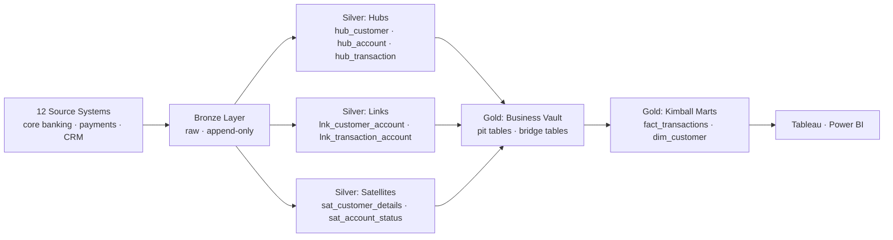

# Scenario: Data Vault Lakehouse

## Overview
Financial services company using Data Vault 2.0 methodology in the Silver layer (for regulatory auditability) with Kimball-style Gold marts on top for BI. Built on Databricks Delta Lake.

**Stack**: Databricks · Delta Lake · dbt · Data Vault 2.0 (Silver) · Kimball star schema (Gold)

## Architecture



## Data Vault 2.0 Core Structures

### Hub: unique business keys

```sql
-- dbt model: models/silver/data_vault/hub_customer.sql
{{ config(materialized='incremental', unique_key='hub_customer_hk') }}

WITH source AS (
    SELECT * FROM {{ ref('stg_corebanking__customers') }}
    
    WHERE load_date > (SELECT MAX(load_date) FROM {{ this }})
    
),
hub AS (
    SELECT
        {{ dbt_utils.generate_surrogate_key(['customer_bk']) }} AS hub_customer_hk,
        customer_bk,  -- business key: customer ID from source system
        load_date,
        record_source  -- which source system provided this key
    FROM source
)
SELECT * FROM hub
QUALIFY ROW_NUMBER() OVER (PARTITION BY hub_customer_hk ORDER BY load_date) = 1
```

### Link: relationships between hubs

```sql
-- dbt model: models/silver/data_vault/lnk_customer_account.sql
{{ config(materialized='incremental', unique_key='lnk_customer_account_hk') }}

SELECT
    {{ dbt_utils.generate_surrogate_key(['customer_bk', 'account_bk']) }} AS lnk_customer_account_hk,
    {{ dbt_utils.generate_surrogate_key(['customer_bk']) }} AS hub_customer_hk,
    {{ dbt_utils.generate_surrogate_key(['account_bk']) }} AS hub_account_hk,
    load_date,
    record_source
FROM {{ ref('stg_corebanking__accounts') }}

WHERE load_date > (SELECT MAX(load_date) FROM {{ this }})

```

### Satellite: descriptive attributes (full history)

```sql
-- dbt model: models/silver/data_vault/sat_customer_details.sql
-- Satellites are always append-only — full change history preserved
{{ config(materialized='incremental', unique_key=['hub_customer_hk', 'load_date']) }}

SELECT
    {{ dbt_utils.generate_surrogate_key(['customer_bk']) }} AS hub_customer_hk,
    load_date,
    record_source,
    {{ dbt_utils.generate_surrogate_key(['customer_bk', 'name', 'email', 'address']) }} AS hash_diff,
    name,
    email,
    address,
    tier,
    kyc_status,
    LEAD(load_date) OVER (PARTITION BY hub_customer_hk ORDER BY load_date) AS load_end_date
FROM {{ ref('stg_corebanking__customers') }}

WHERE load_date > (SELECT MAX(load_date) FROM {{ this }})

```

### Point-in-Time (PIT) table — query performance for DV

```sql
-- PIT table: pre-join hub + satellite for a specific point in time
-- Makes Gold mart queries much faster (avoids complex satellite lookups)
{{ config(materialized='incremental', unique_key=['hub_customer_hk', 'snapshot_date']) }}

SELECT
    h.hub_customer_hk,
    d.snapshot_date,
    -- Latest satellite key as of snapshot date
    MAX(CASE WHEN s.load_date <= d.snapshot_date THEN s.load_date END)
        AS sat_customer_details_ldts
FROM hub_customer h
CROSS JOIN (SELECT DISTINCT snapshot_date FROM dim_date WHERE snapshot_date <= CURRENT_DATE) d
LEFT JOIN sat_customer_details s
    ON h.hub_customer_hk = s.hub_customer_hk
    AND s.load_date <= d.snapshot_date
GROUP BY h.hub_customer_hk, d.snapshot_date
```

### Gold Kimball Mart (built on top of DV)

```sql
-- dbt model: models/marts/finance/dim_customer.sql
-- Business-readable dimension built from DV structures
WITH pit AS (
    SELECT * FROM {{ ref('pit_customer') }}
    WHERE snapshot_date = CURRENT_DATE
),
latest_details AS (
    SELECT s.*
    FROM {{ ref('sat_customer_details') }} s
    JOIN pit p ON s.hub_customer_hk = p.hub_customer_hk
              AND s.load_date = p.sat_customer_details_ldts
)
SELECT
    h.customer_bk AS customer_id,
    d.name,
    d.email,
    d.tier,
    d.kyc_status,
    h.load_date AS first_seen_date
FROM {{ ref('hub_customer') }} h
JOIN latest_details d ON h.hub_customer_hk = d.hub_customer_hk
```

## Key Design Decisions

1. **Why Data Vault in Silver?** — Regulatory requirement to keep full change history for all customer and transaction records (7-year retention). DV satellites are append-only and never delete.
2. **Why Kimball in Gold?** — BI analysts use Tableau. DV structures are too complex for direct BI use. PIT tables + Kimball marts give them fast, simple queries.
3. **Why dbt?** — Data Vault has strict naming conventions and repeatable patterns. dbt macros (from `dbt-datavault` package) generate boilerplate Hub/Link/Satellite DDL.
4. **Why Delta Lake?** — `MERGE INTO` for satellite hash diff comparison. Time travel for point-in-time queries without PIT tables during development.

## References
- [Data Vault 2.0 Methodology](https://datavaultalliance.com/)
- [dbt-datavault package](https://hub.getdbt.com/datavault4dbt/datavault4dbt/latest/)
- [Databricks + Data Vault](https://www.databricks.com/blog/2022/06/24/implementing-data-vault-with-databricks.html)
