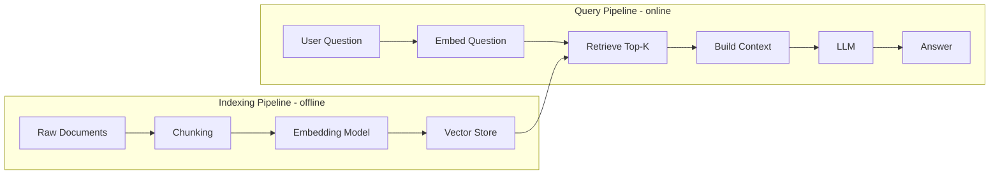

# RAG (Retrieval-Augmented Generation) — Core Concepts

## What problem does this solve?
LLMs have a knowledge cutoff and no access to your private data. Retraining or fine-tuning is expensive and doesn't scale with changing data. RAG solves this by retrieving relevant context from your data at query time and injecting it into the LLM prompt — giving the model accurate, up-to-date, domain-specific answers without retraining.

## How it works



| Node | Details |
|------|---------|
| **Raw Documents** | PDFs, Confluence, Slack |
| **Embedding Model** | text-embedding-3-small |
| **Vector Store** | Pinecone, Weaviate, pgvector |
| **Retrieve Top-K** | similarity search |
| **Build Context** | question + chunks |
| **LLM** | GPT-4, Claude, Llama |

### The two pipelines

**Indexing (offline — run once, then incrementally):**
1. Load raw documents (PDF, HTML, Markdown, database records)
2. Split into chunks (overlapping windows, ~512 tokens each)
3. Embed each chunk → dense vector (1536 dimensions for OpenAI)
4. Store vectors + metadata + original text in vector database

**Query (online — runs per user request):**
1. Embed the user question with the same embedding model
2. Run similarity search in vector database → top-K most relevant chunks
3. Build prompt: system instruction + retrieved chunks + user question
4. Send to LLM → stream answer back to user

### Chunking strategies

Chunking is one of the highest-leverage decisions in a RAG pipeline. Bad chunking = irrelevant retrieval = bad answers.

```python
from langchain.text_splitter import RecursiveCharacterTextSplitter
from langchain.text_splitter import MarkdownHeaderTextSplitter

# Strategy 1: Fixed-size with overlap (simplest, good baseline)
splitter = RecursiveCharacterTextSplitter(
    chunk_size=512,        # tokens per chunk
    chunk_overlap=64,      # overlap to preserve context across chunk boundaries
    separators=["\n\n", "\n", ". ", " ", ""]  # try splitting at paragraph, then sentence
)
chunks = splitter.split_text(document_text)

# Strategy 2: Semantic chunking (split at meaning boundaries, not fixed size)
# Uses embedding similarity to find natural topic boundaries
from langchain_experimental.text_splitter import SemanticChunker
from langchain_openai.embeddings import OpenAIEmbeddings

semantic_splitter = SemanticChunker(
    OpenAIEmbeddings(),
    breakpoint_threshold_type="percentile",
    breakpoint_threshold_amount=95  # split when similarity drops below 95th percentile
)
chunks = semantic_splitter.split_text(document_text)

# Strategy 3: Document-structure-aware (Markdown headers as boundaries)
md_splitter = MarkdownHeaderTextSplitter(
    headers_to_split_on=[
        ("#", "h1"), ("##", "h2"), ("###", "h3")
    ]
)
chunks = md_splitter.split_text(markdown_document)
# Each chunk carries header metadata: {"h1": "Architecture", "h2": "Storage Layer"}

# Strategy 4: Parent-child chunking (store large parent, retrieve small child)
# Small child chunks for precise retrieval
# Large parent chunks for full context passed to LLM
from langchain.retrievers import ParentDocumentRetriever
from langchain.storage import InMemoryStore

child_splitter = RecursiveCharacterTextSplitter(chunk_size=200)
parent_splitter = RecursiveCharacterTextSplitter(chunk_size=2000)

store = InMemoryStore()
retriever = ParentDocumentRetriever(
    vectorstore=vectorstore,
    docstore=store,
    child_splitter=child_splitter,
    parent_splitter=parent_splitter
)
```

### Embedding models

```python
from openai import OpenAI
import numpy as np

client = OpenAI()

# OpenAI text-embedding-3-small (1536 dims, cheap, fast)
def embed_text(text: str) -> list[float]:
    response = client.embeddings.create(
        input=text,
        model="text-embedding-3-small"
    )
    return response.data[0].embedding

# Batch embedding (much more efficient for indexing)
def embed_batch(texts: list[str]) -> list[list[float]]:
    response = client.embeddings.create(
        input=texts,          # up to 2048 texts per request
        model="text-embedding-3-small"
    )
    return [item.embedding for item in response.data]

# Cosine similarity (what vector DBs compute during retrieval)
def cosine_similarity(a: list[float], b: list[float]) -> float:
    a, b = np.array(a), np.array(b)
    return np.dot(a, b) / (np.linalg.norm(a) * np.linalg.norm(b))

# Embedding model comparison:
# text-embedding-3-small: 1536 dims, $0.02/1M tokens, good for most use cases
# text-embedding-3-large: 3072 dims, $0.13/1M tokens, best quality
# text-embedding-ada-002: 1536 dims (legacy, worse than 3-small)
# Sentence-transformers (local): all-MiniLM-L6-v2, free, 384 dims, fast
# Cohere embed-v3: best for multilingual
```

### Building the retrieval and generation pipeline

```python
from langchain_openai import OpenAIEmbeddings, ChatOpenAI
from langchain_pinecone import PineconeVectorStore
from langchain.chains import RetrievalQA
from langchain.prompts import PromptTemplate

# Embeddings and vector store
embeddings = OpenAIEmbeddings(model="text-embedding-3-small")
vectorstore = PineconeVectorStore(
    index_name="my-rag-index",
    embedding=embeddings
)

# Retriever with tunable parameters
retriever = vectorstore.as_retriever(
    search_type="similarity",    # or "mmr" (max marginal relevance — reduces redundancy)
    search_kwargs={
        "k": 5,                  # retrieve top-5 chunks
        "score_threshold": 0.7,  # only return chunks with similarity > 0.7
        "filter": {"source": "internal-docs"}  # metadata filter
    }
)

# System prompt — critical for answer quality
system_prompt = """You are a helpful data engineering assistant with access to internal documentation.

Use ONLY the following context to answer the question. If the context doesn't contain enough 
information to answer confidently, say "I don't have enough information in the provided context."

Do not make up information. Cite the source document when possible.

Context:
{context}

Question: {question}

Answer:"""

prompt = PromptTemplate(
    input_variables=["context", "question"],
    template=system_prompt
)

llm = ChatOpenAI(model="gpt-4o", temperature=0)

qa_chain = RetrievalQA.from_chain_type(
    llm=llm,
    chain_type="stuff",       # "stuff" = concatenate all chunks, "map_reduce" = summarise each
    retriever=retriever,
    chain_type_kwargs={"prompt": prompt},
    return_source_documents=True  # include source chunks in response
)

# Run a query
result = qa_chain.invoke({"query": "How do I configure Auto Loader for incremental ingestion?"})
print(result["result"])
print("\nSources:")
for doc in result["source_documents"]:
    print(f"  - {doc.metadata.get('source', 'unknown')}: {doc.page_content[:100]}...")
```

### Advanced retrieval: HyDE and re-ranking

```python
# HyDE (Hypothetical Document Embeddings):
# Generate a hypothetical answer → embed it → use that vector for retrieval
# Often retrieves better chunks than embedding the raw question

from langchain.chains import HypotheticalDocumentEmbedder

hyde_embeddings = HypotheticalDocumentEmbedder.from_llm(
    llm=ChatOpenAI(model="gpt-4o-mini"),
    base_embeddings=OpenAIEmbeddings(),
    custom_prompts=["Please write a passage from a technical document that answers: {QUESTION}"]
)

# Re-ranking: retrieve top-20, then re-rank with a cross-encoder, return top-5
# Cross-encoders are slower but much more accurate than bi-encoders for ranking
from sentence_transformers import CrossEncoder

reranker = CrossEncoder("cross-encoder/ms-marco-MiniLM-L-6-v2")

def rerank_documents(query: str, documents: list, top_k: int = 5) -> list:
    pairs = [(query, doc.page_content) for doc in documents]
    scores = reranker.predict(pairs)
    scored_docs = sorted(zip(scores, documents), key=lambda x: x[0], reverse=True)
    return [doc for _, doc in scored_docs[:top_k]]
```

## Real-world scenario

Financial services firm: 50,000-page regulatory knowledge base (Basel III, MiFID II, internal risk policies). Compliance team spends 2+ hours per query manually searching PDFs. Accuracy unreliable due to document version confusion.

After RAG system:
- All PDFs ingested and chunked (structure-aware splitting on section headings)
- Parent-child chunking: 200-token children for retrieval, 2000-token parents passed to LLM
- Metadata: document version, effective date, jurisdiction
- Filtered retrieval: queries filtered by jurisdiction and date range
- Result: sub-10-second answers with source citations, 87% accuracy on benchmark question set

## What goes wrong in production

- **Chunking cuts mid-sentence** — fixed-size chunking with no overlap cuts a key sentence between two chunks; neither chunk individually answers the question. Use overlap (10-15% of chunk size) and prefer sentence/paragraph boundaries.
- **Embedding model mismatch** — indexing with `text-embedding-3-small` but querying with `text-embedding-3-large` produces incompatible vectors; retrieval returns random results. Always use the same model for indexing and querying.
- **No metadata filtering** — retrieval returns relevant chunks from the wrong time period or wrong product line. Always store and filter on metadata (date, source, category).
- **Stuffing too many chunks** — passing 20 chunks to GPT-4 (128K context) doesn't always improve answers; the model loses focus on the most relevant passages ("lost in the middle" problem). Use 3-7 high-quality chunks after re-ranking.
- **Stale index** — documents updated in the source but not re-indexed. Build incremental indexing triggered by source document changes.

## References
- [LangChain RAG Tutorial](https://python.langchain.com/docs/tutorials/rag/)
- [LlamaIndex Documentation](https://docs.llamaindex.ai/)
- [Pinecone RAG Guide](https://www.pinecone.io/learn/retrieval-augmented-generation/)
- [Parent Document Retriever](https://python.langchain.com/docs/how_to/parent_document_retriever/)
- [HyDE Paper](https://arxiv.org/abs/2212.10496)
