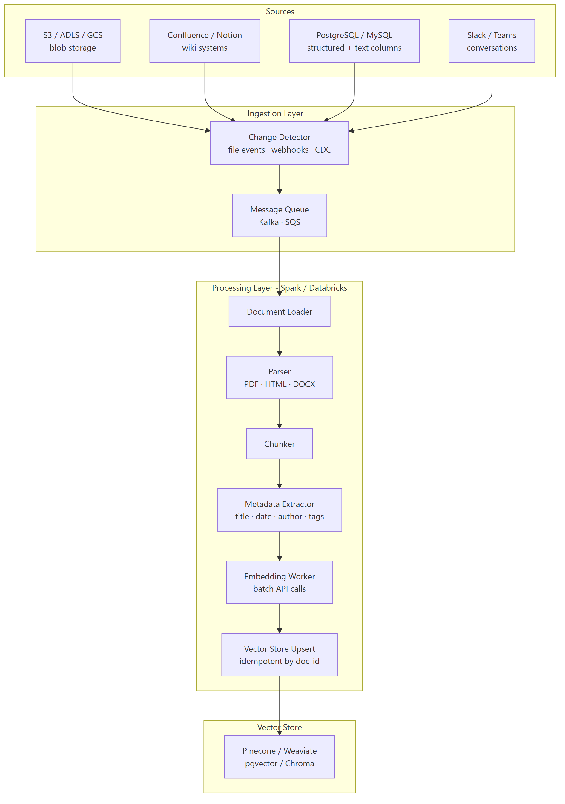

# RAG Pipeline Engineering — Production Indexing at Scale

## What problem does this solve?
A prototype RAG chatbot running on 100 documents breaks at 1 million documents. Production RAG requires: incremental indexing (only re-index changed documents), parallel embedding at scale, idempotent upserts, metadata management, and monitoring for index drift.

## How it works



### Production indexing pipeline (Databricks + Delta Lake)

```python
# Databricks notebook: rag_indexing_pipeline.py
from pyspark.sql import functions as F
from pyspark.sql.types import *
import hashlib, json
from datetime import datetime

# ─── Step 1: Track document state in Delta (idempotent indexing) ───

spark.sql("""
    CREATE TABLE IF NOT EXISTS rag.document_index (
        doc_id          STRING NOT NULL,   -- hash of source path
        source_path     STRING,
        content_hash    STRING,            -- hash of file content (detect changes)
        chunk_count     INT,
        last_indexed_at TIMESTAMP,
        status          STRING,            -- 'indexed' | 'failed' | 'pending'
        error_message   STRING
    ) USING DELTA
    TBLPROPERTIES ('delta.enableChangeDataFeed' = 'true')
""")

# ─── Step 2: Detect new/changed documents ───

def get_file_content_hash(content: bytes) -> str:
    return hashlib.sha256(content).hexdigest()

def get_doc_id(source_path: str) -> str:
    return hashlib.md5(source_path.encode()).hexdigest()

# Auto Loader watches blob storage for new/modified files
new_docs_df = (
    spark.readStream
    .format("cloudFiles")
    .option("cloudFiles.format", "binaryFile")  # read raw bytes
    .option("cloudFiles.includeExistingFiles", "true")
    .option("cloudFiles.schemaLocation", "/chk/rag-schema/")
    .load("abfss://documents@storage.dfs.core.windows.net/knowledge-base/")
    .select(
        F.col("path").alias("source_path"),
        F.col("content"),
        F.col("modificationTime").alias("file_modified_at"),
        F.sha2(F.col("content"), 256).alias("content_hash")
    )
    .withColumn("doc_id", F.md5(F.col("source_path")))
)

# ─── Step 3: Parse, chunk, embed per micro-batch ───

def process_batch(batch_df, epoch_id):
    from openai import OpenAI
    import fitz  # PyMuPDF for PDF
    from langchain.text_splitter import RecursiveCharacterTextSplitter
    from pinecone import Pinecone

    oai_client = OpenAI()
    pc = Pinecone(api_key=dbutils.secrets.get("prod-kv", "pinecone-api-key"))
    index = pc.Index("knowledge-base")

    splitter = RecursiveCharacterTextSplitter(chunk_size=512, chunk_overlap=64)

    rows = batch_df.collect()
    vectors_to_upsert = []
    index_records = []

    for row in rows:
        try:
            # Parse document (PDF or plain text)
            content_bytes = bytes(row.content)
            if row.source_path.endswith(".pdf"):
                doc = fitz.open(stream=content_bytes, filetype="pdf")
                text = "\n".join(page.get_text() for page in doc)
            else:
                text = content_bytes.decode("utf-8", errors="ignore")

            # Chunk
            chunks = splitter.split_text(text)

            # Embed in batches of 100
            all_embeddings = []
            for i in range(0, len(chunks), 100):
                batch_texts = chunks[i:i+100]
                resp = oai_client.embeddings.create(
                    input=batch_texts,
                    model="text-embedding-3-small"
                )
                all_embeddings.extend([e.embedding for e in resp.data])

            # Build Pinecone vectors
            for i, (chunk, embedding) in enumerate(zip(chunks, all_embeddings)):
                chunk_id = f"{row.doc_id}_{i}"
                vectors_to_upsert.append({
                    "id": chunk_id,
                    "values": embedding,
                    "metadata": {
                        "doc_id": row.doc_id,
                        "source_path": row.source_path,
                        "chunk_index": i,
                        "chunk_count": len(chunks),
                        "content_hash": row.content_hash,
                        "text": chunk[:1000],  # store truncated text in metadata
                        "indexed_at": datetime.utcnow().isoformat()
                    }
                })

            index_records.append((row.doc_id, row.source_path, row.content_hash,
                                   len(chunks), datetime.utcnow(), "indexed", None))

        except Exception as e:
            index_records.append((row.doc_id, row.source_path, row.content_hash,
                                   0, datetime.utcnow(), "failed", str(e)))

    # Upsert vectors to Pinecone (in batches of 100)
    if vectors_to_upsert:
        for i in range(0, len(vectors_to_upsert), 100):
            index.upsert(vectors=vectors_to_upsert[i:i+100])

    # Update document index in Delta
    if index_records:
        schema = StructType([
            StructField("doc_id", StringType()), StructField("source_path", StringType()),
            StructField("content_hash", StringType()), StructField("chunk_count", IntegerType()),
            StructField("last_indexed_at", TimestampType()), StructField("status", StringType()),
            StructField("error_message", StringType())
        ])
        records_df = spark.createDataFrame(index_records, schema)
        records_df.write.format("delta").mode("append").saveAsTable("rag.document_index")

# Start streaming indexing pipeline
(new_docs_df
 .writeStream
 .foreachBatch(process_batch)
 .option("checkpointLocation", "/chk/rag-indexer/")
 .trigger(processingTime="5 minutes")
 .start())
```

### Handling document deletions

```python
# When a document is deleted from source, remove its vectors from the index
def handle_deletions(deleted_doc_ids: list[str], pinecone_index):
    """Delete all chunks belonging to deleted documents"""
    # Pinecone: delete by metadata filter
    for doc_id in deleted_doc_ids:
        pinecone_index.delete(filter={"doc_id": {"$eq": doc_id}})

    # Update Delta index
    spark.sql(f"""
        DELETE FROM rag.document_index
        WHERE doc_id IN ({','.join(f"'{d}'" for d in deleted_doc_ids)})
    """)

# Detect deletions via Delta CDF (Change Data Feed)
cdf_df = spark.readStream \
    .format("delta") \
    .option("readChangeFeed", "true") \
    .option("startingVersion", "latest") \
    .table("rag.source_document_registry") \
    .filter(F.col("_change_type") == "delete")
```

### Multi-source connector pattern

```python
# Abstract loader interface — add new sources without changing the pipeline
from abc import ABC, abstractmethod
from dataclasses import dataclass

@dataclass
class RawDocument:
    doc_id: str
    source_path: str
    content: str
    metadata: dict
    last_modified: datetime

class DocumentLoader(ABC):
    @abstractmethod
    def load_changed_since(self, since: datetime) -> list[RawDocument]:
        pass

class ConfluenceLoader(DocumentLoader):
    def __init__(self, space_key: str, token: str):
        self.space_key = space_key
        self.headers = {"Authorization": f"Bearer {token}"}

    def load_changed_since(self, since: datetime) -> list[RawDocument]:
        import requests
        from bs4 import BeautifulSoup

        resp = requests.get(
            f"https://mycompany.atlassian.net/wiki/rest/api/content",
            params={
                "spaceKey": self.space_key,
                "expand": "body.storage,metadata.labels,version",
                "start": 0, "limit": 100,
                "modifiedDate": since.strftime("%Y-%m-%d")
            },
            headers=self.headers
        )
        documents = []
        for page in resp.json()["results"]:
            html_content = page["body"]["storage"]["value"]
            text = BeautifulSoup(html_content, "html.parser").get_text()
            documents.append(RawDocument(
                doc_id=f"confluence_{page['id']}",
                source_path=f"confluence://{self.space_key}/{page['title']}",
                content=text,
                metadata={
                    "title": page["title"],
                    "space": self.space_key,
                    "version": page["version"]["number"],
                    "labels": [l["name"] for l in page["metadata"]["labels"]["results"]]
                },
                last_modified=datetime.fromisoformat(page["version"]["when"])
            ))
        return documents

class S3PdfLoader(DocumentLoader):
    def load_changed_since(self, since: datetime) -> list[RawDocument]:
        import boto3, fitz
        s3 = boto3.client("s3")
        documents = []
        paginator = s3.get_paginator("list_objects_v2")
        for page in paginator.paginate(Bucket="my-docs-bucket"):
            for obj in page.get("Contents", []):
                if obj["LastModified"].replace(tzinfo=None) > since:
                    pdf_bytes = s3.get_object(Bucket="my-docs-bucket",
                                              Key=obj["Key"])["Body"].read()
                    doc = fitz.open(stream=pdf_bytes, filetype="pdf")
                    text = "\n".join(p.get_text() for p in doc)
                    documents.append(RawDocument(
                        doc_id=f"s3_{obj['Key'].replace('/', '_')}",
                        source_path=f"s3://my-docs-bucket/{obj['Key']}",
                        content=text,
                        metadata={"file_name": obj["Key"], "size": obj["Size"]},
                        last_modified=obj["LastModified"].replace(tzinfo=None)
                    ))
        return documents
```

## Real-world scenario

Enterprise with 500K internal documents across Confluence (300K pages), SharePoint (100K files), and S3 (100K PDFs). Full re-index takes 18 hours and costs $800 in embedding API calls. Frequency needed: daily.

Solution: incremental indexing using content hashing. Delta table tracks `content_hash` per document. Only documents where the hash changed since last run are re-processed. Daily incremental run covers ~2,000 changed documents. Runtime: 12 minutes, cost: $3.

## What goes wrong in production

- **Re-indexing entire corpus on schema change** — adding a new metadata field shouldn't require re-embedding. Separate metadata updates (just update the vector metadata) from content changes (requires re-embedding).
- **Pinecone upsert without deleting old chunks** — updating a document by upserting new chunks without deleting the old ones leaves stale chunks in the index. Always delete by `doc_id` filter before upserting.
- **Embedding API rate limits during bulk indexing** — OpenAI has RPM and TPM limits. Add exponential backoff and batch sizes ≤ 2048 texts per request.
- **No monitoring of index freshness** — source documents updated but indexing pipeline silently failing for 3 days. Monitor `last_indexed_at` lag in `rag.document_index`.

## References
- [LangChain Document Loaders](https://python.langchain.com/docs/concepts/document_loaders/)
- [Pinecone Upsert Guide](https://docs.pinecone.io/guides/data/upsert-data)
- [Auto Loader Databricks](https://docs.databricks.com/en/ingestion/cloud-object-storage/auto-loader/index.html)
- [OpenAI Embeddings Best Practices](https://platform.openai.com/docs/guides/embeddings)
