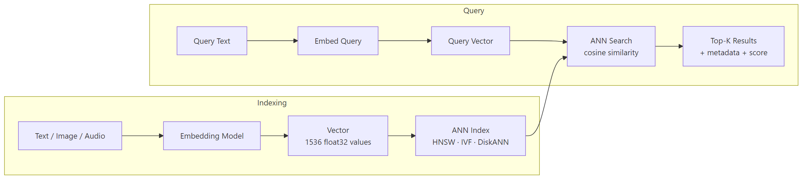

# Vector Databases

## What problem does this solve?
Traditional databases can't efficiently find "similar" rows. A SQL `LIKE` or full-text search matches keywords, not meaning. Vector databases store high-dimensional embeddings and run approximate nearest-neighbour (ANN) searches in milliseconds — enabling semantic search, RAG retrieval, recommendation, and anomaly detection at scale.

## How it works



### ANN algorithms

| Algorithm | How it works | Memory | Speed | Recall | Best for |
|---|---|---|---|---|---|
| **HNSW** (Hierarchical NSW) | Graph of navigable layers, greedy search | High | Very fast | Very high | In-memory, high QPS |
| **IVF** (Inverted File) | Cluster centroids, search nearest clusters | Medium | Fast | High | Large datasets, balanced |
| **IVF-PQ** (Product Quantisation) | Compress vectors by encoding sub-vectors | Low | Fast | Medium | Massive scale, memory-constrained |
| **DiskANN** | Graph index on SSD, not RAM | Very low | Fast | High | Billions of vectors |
| **FLAT** (brute force) | Exact dot-product over all vectors | High | Slow | 100% | Small datasets, evaluation |

### Vector database comparison

| | Pinecone | Weaviate | Qdrant | pgvector | Chroma | Milvus |
|---|---|---|---|---|---|---|
| Type | Managed SaaS | Self-hosted / Cloud | Self-hosted / Cloud | PostgreSQL ext | In-process / hosted | Self-hosted / Cloud |
| Scale | Billions | Billions | Hundreds of millions | Millions (PG limits) | Millions | Billions |
| ANN index | Proprietary | HNSW | HNSW / IVF | HNSW / IVFFlat | HNSW | HNSW / DiskANN |
| Metadata filtering | Yes (fast) | Yes + GraphQL | Yes | Yes (SQL) | Yes | Yes |
| Multi-tenancy | Namespaces | Multi-tenancy classes | Collections | Schemas | Collections | Partitions |
| Best for | Prod RAG (managed) | Multi-modal, knowledge graph | High-perf self-hosted | Already on Postgres | Dev / prototyping | Very large scale |

### Pinecone — managed vector database

```python
from pinecone import Pinecone, ServerlessSpec

pc = Pinecone(api_key="your-api-key")

# Create index
pc.create_index(
    name="knowledge-base",
    dimension=1536,           # must match embedding model dimension
    metric="cosine",          # cosine | euclidean | dotproduct
    spec=ServerlessSpec(
        cloud="aws",
        region="us-east-1"
    )
)

index = pc.Index("knowledge-base")

# Upsert vectors with metadata
vectors = [
    {
        "id": "doc_001_chunk_0",
        "values": [0.1, 0.2, ...],   # 1536-dim embedding
        "metadata": {
            "doc_id": "doc_001",
            "source": "confluence",
            "title": "Delta Lake Internals",
            "text": "Delta Lake uses a transaction log...",
            "category": "databricks",
            "created_date": "2024-01-15"
        }
    }
]
index.upsert(vectors=vectors, namespace="internal-docs")

# Query with metadata filtering
results = index.query(
    vector=query_embedding,
    top_k=5,
    namespace="internal-docs",
    filter={
        "category": {"$eq": "databricks"},
        "created_date": {"$gte": "2024-01-01"}
    },
    include_metadata=True,
    include_values=False  # don't return the vectors themselves (saves bandwidth)
)

for match in results.matches:
    print(f"Score: {match.score:.4f} | {match.metadata['title']}")
    print(f"  {match.metadata['text'][:200]}")

# Delete by metadata (when source doc is updated/deleted)
index.delete(filter={"doc_id": {"$eq": "doc_001"}}, namespace="internal-docs")

# Index stats
stats = index.describe_index_stats()
print(f"Total vectors: {stats.total_vector_count}")
print(f"Namespaces: {stats.namespaces}")
```

### pgvector — vector search in PostgreSQL

```sql
-- Install extension
CREATE EXTENSION IF NOT EXISTS vector;

-- Create table with vector column
CREATE TABLE document_chunks (
    id              SERIAL PRIMARY KEY,
    doc_id          VARCHAR(64) NOT NULL,
    chunk_index     INTEGER NOT NULL,
    source_path     TEXT,
    content         TEXT,
    category        VARCHAR(50),
    created_date    DATE,
    embedding       VECTOR(1536)  -- pgvector type
);

-- Create HNSW index (fast inserts, very fast queries)
CREATE INDEX ON document_chunks
    USING hnsw (embedding vector_cosine_ops)
    WITH (m = 16, ef_construction = 64);
-- m: connections per layer (higher = better recall, more memory)
-- ef_construction: search depth during build (higher = better quality, slower build)

-- Alternatively: IVFFlat (faster build, slightly lower recall)
CREATE INDEX ON document_chunks
    USING ivfflat (embedding vector_cosine_ops)
    WITH (lists = 100);  -- number of clusters (sqrt(total_rows) is a good baseline)

-- Semantic search with metadata filter
SELECT
    id, doc_id, source_path, content,
    1 - (embedding <=> '[0.1, 0.2, ...]'::vector) AS similarity  -- cosine similarity
FROM document_chunks
WHERE category = 'databricks'
  AND created_date >= '2024-01-01'
ORDER BY embedding <=> '[0.1, 0.2, ...]'::vector  -- <=> is cosine distance operator
LIMIT 5;

-- <=>  cosine distance (use for normalised embeddings)
-- <->  L2 (Euclidean) distance
-- <#>  negative inner product (use for dot product similarity, unnormalised)

-- Hybrid search: combine vector similarity + full-text search
SELECT
    id, content,
    1 - (embedding <=> query_vec) AS vector_score,
    ts_rank(to_tsvector('english', content), plainto_tsquery('english', 'delta lake')) AS text_score
FROM document_chunks,
     (SELECT '[...]'::vector AS query_vec) AS q
WHERE to_tsvector('english', content) @@ plainto_tsquery('english', 'delta lake')
ORDER BY (0.7 * (1 - (embedding <=> query_vec)) + 0.3 * ts_rank(...)) DESC
LIMIT 5;
```

### Weaviate — multi-modal with hybrid search

```python
import weaviate
from weaviate.classes.config import Configure, Property, DataType

client = weaviate.connect_to_cloud(
    cluster_url="https://my-cluster.weaviate.network",
    auth_credentials=weaviate.auth.AuthApiKey("your-api-key")
)

# Create collection (schema)
client.collections.create(
    name="DocumentChunk",
    vectorizer_config=Configure.Vectorizer.text2vec_openai(
        model="text-embedding-3-small"
    ),
    properties=[
        Property(name="content", data_type=DataType.TEXT),
        Property(name="source_path", data_type=DataType.TEXT),
        Property(name="category", data_type=DataType.TEXT),
        Property(name="doc_id", data_type=DataType.TEXT),
    ]
)

collection = client.collections.get("DocumentChunk")

# Batch insert (Weaviate auto-embeds using configured vectorizer)
with collection.batch.dynamic() as batch:
    for chunk in chunks:
        batch.add_object(properties={
            "content": chunk["text"],
            "source_path": chunk["source"],
            "category": chunk["category"],
            "doc_id": chunk["doc_id"]
        })

# Hybrid search (combines BM25 keyword + vector similarity)
results = collection.query.hybrid(
    query="how does delta lake handle concurrent writes",
    alpha=0.75,           # 0 = pure BM25, 1 = pure vector, 0.75 = mostly vector
    filters=weaviate.classes.query.Filter.by_property("category").equal("databricks"),
    limit=5,
    return_metadata=weaviate.classes.query.MetadataQuery(score=True)
)

for obj in results.objects:
    print(f"Score: {obj.metadata.score:.4f}")
    print(f"  {obj.properties['content'][:200]}")
```

## Real-world scenario

E-commerce recommendation engine: 50M product embeddings, need to find "similar products" in < 50ms. pgvector at 50M rows with HNSW: p99 latency 280ms — too slow. Pinecone at same scale: p99 latency 8ms with 99.9% recall.

Decision: pgvector for internal document RAG (< 500K chunks, team already on Postgres, no extra infrastructure), Pinecone for product recommendations (scale + latency requirements exceed what pgvector handles well).

## What goes wrong in production

- **Wrong distance metric** — using L2 distance for embeddings that aren't normalised. OpenAI embeddings are normalised, so cosine and dot product give equivalent results. Use cosine for correctness.
- **No namespace isolation** — all customers' data in one Pinecone namespace. One customer's retrieval returns another customer's documents. Always use per-tenant namespaces.
- **IVFFlat without enough `lists`** — setting `lists = 10` for 1M vectors. Each list contains 100K vectors; search scans entire lists. Use `lists ≈ sqrt(total_rows)`. For 1M rows: `lists = 1000`.
- **Forgetting to vacuum pgvector index** — deleted vectors leave dead tuples. Run `VACUUM ANALYZE document_chunks` after bulk deletes.

## References
- [pgvector GitHub](https://github.com/pgvector/pgvector)
- [Pinecone Documentation](https://docs.pinecone.io/)
- [Weaviate Documentation](https://weaviate.io/developers/weaviate)
- [Qdrant Documentation](https://qdrant.tech/documentation/)
- [HNSW Paper](https://arxiv.org/abs/1603.09320)
