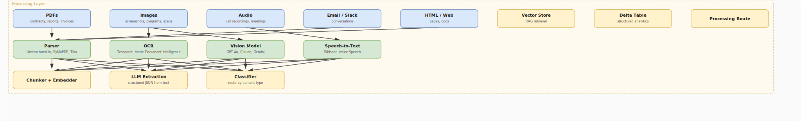

# Unstructured Data Pipelines

## What problem does this solve?
80% of enterprise data is unstructured — PDFs, images, emails, call recordings, contracts, invoices. Standard data pipelines handle tabular data well but break on unstructured content. AI-powered unstructured data pipelines extract structured signals from raw content at scale, feeding both analytical systems and RAG indexes.

## How it works

<!-- Editable: open diagrams/11-ai-data-engineering--04-unstructured-data-pipelines.drawio.svg in draw.io -->



### PDF parsing — layout-aware extraction

```python
import fitz  # PyMuPDF
from unstructured.partition.pdf import partition_pdf
from unstructured.staging.base import convert_to_dict

# Option 1: PyMuPDF — fast, text-only (no layout awareness)
def extract_text_pymupdf(pdf_path: str) -> str:
    doc = fitz.open(pdf_path)
    text = ""
    for page_num, page in enumerate(doc):
        text += f"\n--- Page {page_num + 1} ---\n"
        text += page.get_text("text")  # "text" | "blocks" | "dict" | "html"
    return text

# Get text with coordinates (for table detection)
def extract_blocks_pymupdf(pdf_path: str) -> list[dict]:
    doc = fitz.open(pdf_path)
    blocks = []
    for page in doc:
        for block in page.get_text("dict")["blocks"]:
            if block["type"] == 0:  # type 0 = text, type 1 = image
                for line in block["lines"]:
                    text = " ".join(span["text"] for span in line["spans"])
                    blocks.append({
                        "page": page.number,
                        "text": text,
                        "bbox": block["bbox"]  # (x0, y0, x1, y1)
                    })
    return blocks

# Option 2: Unstructured.io — layout-aware, extracts tables, titles, headers
def extract_structured_elements(pdf_path: str) -> list[dict]:
    elements = partition_pdf(
        filename=pdf_path,
        strategy="hi_res",         # "fast" (text-only) | "hi_res" (OCR+layout)
        infer_table_structure=True, # detect and parse tables
        include_page_breaks=True,
        extract_images_in_pdf=True  # extract embedded images
    )
    return convert_to_dict(elements)

# Output elements have types: Title, NarrativeText, Table, Image, ListItem, Header
# Table elements include HTML representation of the table

# Option 3: Azure Document Intelligence (best for complex/scanned docs)
from azure.ai.formrecognizer import DocumentAnalysisClient
from azure.core.credentials import AzureKeyCredential

def extract_with_azure_di(pdf_path: str) -> dict:
    client = DocumentAnalysisClient(
        endpoint="https://mydi.cognitiveservices.azure.com/",
        credential=AzureKeyCredential(api_key)
    )
    with open(pdf_path, "rb") as f:
        poller = client.begin_analyze_document("prebuilt-layout", f)
    result = poller.result()

    extracted = {"pages": [], "tables": [], "key_value_pairs": []}

    for page in result.pages:
        extracted["pages"].append({
            "page_number": page.page_number,
            "lines": [line.content for line in page.lines],
            "tables_on_page": [t for t in result.tables if t.bounding_regions[0].page_number == page.page_number]
        })

    for table in result.tables:
        table_data = {}
        for cell in table.cells:
            table_data[(cell.row_index, cell.column_index)] = cell.content
        extracted["tables"].append(table_data)

    return extracted
```

### LLM-based structured extraction from text

```python
from openai import OpenAI
from pydantic import BaseModel, Field
from typing import Optional
import json

client = OpenAI()

# Define the output schema with Pydantic
class InvoiceExtraction(BaseModel):
    invoice_number: str = Field(description="Invoice or reference number")
    vendor_name: str = Field(description="Name of the vendor/supplier")
    invoice_date: str = Field(description="Date of invoice in ISO format YYYY-MM-DD")
    due_date: Optional[str] = Field(description="Payment due date in ISO format")
    total_amount: float = Field(description="Total invoice amount")
    currency: str = Field(description="Currency code (e.g., USD, EUR, SGD)")
    line_items: list[dict] = Field(description="List of line items with description and amount")
    confidence: float = Field(description="Confidence score 0-1 for the extraction")

def extract_invoice_data(text: str) -> InvoiceExtraction:
    """Extract structured invoice data from raw text using LLM"""
    response = client.chat.completions.create(
        model="gpt-4o-mini",
        messages=[
            {
                "role": "system",
                "content": """Extract structured invoice data from the provided text.
Return ONLY valid JSON matching the specified schema.
If a field cannot be determined, use null.
Be precise with amounts — do not round."""
            },
            {
                "role": "user",
                "content": f"Extract invoice data from:\n\n{text}"
            }
        ],
        response_format={"type": "json_object"},
        temperature=0  # deterministic for extraction tasks
    )

    raw = json.loads(response.choices[0].message.content)
    return InvoiceExtraction(**raw)

# Batch processing with Spark (scale to millions of documents)
from pyspark.sql.functions import udf
from pyspark.sql.types import StructType, StructField, StringType, DoubleType

@udf(returnType=StringType())
def extract_invoice_udf(pdf_text: str) -> str:
    """Spark UDF wrapping LLM extraction"""
    try:
        result = extract_invoice_data(pdf_text)
        return result.json()
    except Exception as e:
        return json.dumps({"error": str(e), "confidence": 0.0})

# Apply to DataFrame of PDFs
df_with_extractions = pdf_df \
    .withColumn("extracted_json", extract_invoice_udf("pdf_text")) \
    .withColumn("invoice_data", F.from_json("extracted_json", invoice_schema))
```

### Audio processing pipeline (call recordings → structured data)

```python
import whisper
from openai import OpenAI

# Speech to text with Whisper (local, open-source)
def transcribe_audio(audio_path: str) -> dict:
    model = whisper.load_model("base")  # tiny/base/small/medium/large
    result = model.transcribe(
        audio_path,
        language="en",
        word_timestamps=True,    # timestamp per word
        verbose=False
    )
    return {
        "text": result["text"],
        "segments": result["segments"],  # [{start, end, text}]
        "language": result["language"]
    }

# OpenAI Whisper API (faster, no GPU needed)
def transcribe_audio_api(audio_path: str) -> str:
    oai = OpenAI()
    with open(audio_path, "rb") as f:
        transcript = oai.audio.transcriptions.create(
            model="whisper-1",
            file=f,
            response_format="verbose_json",
            timestamp_granularities=["segment"]
        )
    return transcript

# Extract structured insights from call transcript
class CallAnalysis(BaseModel):
    sentiment: str          # positive / neutral / negative
    topics: list[str]       # main topics discussed
    action_items: list[str] # follow-up actions mentioned
    customer_pain_points: list[str]
    product_mentioned: Optional[str]
    escalation_required: bool
    call_summary: str       # 2-3 sentence summary

def analyse_call(transcript: str) -> CallAnalysis:
    response = client.chat.completions.create(
        model="gpt-4o",
        messages=[
            {"role": "system", "content": "Analyse this customer support call transcript. Return JSON."},
            {"role": "user", "content": transcript}
        ],
        response_format={"type": "json_object"},
        temperature=0
    )
    return CallAnalysis(**json.loads(response.choices[0].message.content))
```

### Image and document intelligence

```python
import base64
from openai import OpenAI

client = OpenAI()

def encode_image(image_path: str) -> str:
    with open(image_path, "rb") as f:
        return base64.b64encode(f.read()).decode("utf-8")

# Extract data from images (invoices, forms, screenshots, charts)
def extract_from_image(image_path: str, extraction_prompt: str) -> str:
    base64_image = encode_image(image_path)
    response = client.chat.completions.create(
        model="gpt-4o",
        messages=[
            {
                "role": "user",
                "content": [
                    {
                        "type": "image_url",
                        "image_url": {
                            "url": f"data:image/jpeg;base64,{base64_image}",
                            "detail": "high"  # "low" | "high" — high = better for small text
                        }
                    },
                    {
                        "type": "text",
                        "text": extraction_prompt
                    }
                ]
            }
        ],
        max_tokens=1000
    )
    return response.choices[0].message.content

# Example: extract table from screenshot
table_data = extract_from_image(
    "dashboard_screenshot.png",
    "Extract all numeric data from this dashboard screenshot as JSON. "
    "Include all metrics, values, dates, and labels visible."
)

# OCR for scanned documents (Tesseract)
import pytesseract
from PIL import Image

def ocr_image(image_path: str) -> str:
    image = Image.open(image_path)
    text = pytesseract.image_to_string(
        image,
        config="--oem 3 --psm 6",  # LSTM OCR engine, uniform block of text
        lang="eng"
    )
    return text
```

### Full unstructured pipeline on Databricks

```python
# Databricks: process 100K+ documents in parallel using Spark + UDFs

from pyspark.sql import functions as F
from pyspark.sql.types import StringType

# Register all processing steps as Pandas UDFs (vectorised)
@pandas_udf(returnType=StringType())
def parse_pdf_udf(paths: pd.Series) -> pd.Series:
    import fitz
    results = []
    for path in paths:
        try:
            doc = fitz.open(path)
            text = "\n".join(page.get_text() for page in doc)
            results.append(text)
        except:
            results.append("")
    return pd.Series(results)

@pandas_udf(returnType=StringType())
def extract_metadata_udf(texts: pd.Series) -> pd.Series:
    # Call LLM API in batch
    results = []
    for text in texts:
        result = extract_invoice_data(text[:4000])  # truncate to context limit
        results.append(result.json())
    return pd.Series(results)

# Pipeline: read file paths → parse → extract → write to Delta
df = spark.table("bronze.raw_document_paths") \
    .withColumn("pdf_text", parse_pdf_udf("file_path")) \
    .filter(F.length("pdf_text") > 100) \
    .withColumn("extracted_json", extract_metadata_udf("pdf_text")) \
    .withColumn("invoice", F.from_json("extracted_json", invoice_schema))

df.write.format("delta").mode("append").saveAsTable("silver.parsed_invoices")
```

## Real-world scenario

Insurance company: 200K claims documents per month (PDFs with handwritten notes, typed text, embedded images). Manual data entry taking 48 hours per claim. Errors in 12% of manually entered records.

After unstructured pipeline:
- Azure Document Intelligence for high-fidelity PDF extraction (handles handwriting)
- GPT-4o for structured field extraction (claimant name, incident date, amount, supporting evidence)
- Confidence score threshold: > 0.85 → auto-ingest to claims system, < 0.85 → human review queue
- Result: 82% of claims auto-processed, processing time 48 hours → 4 minutes, error rate 12% → 2.1%

## What goes wrong in production

- **LLM hallucinating field values** — LLM invents an invoice amount when the text is ambiguous. Always include `confidence` in the extraction schema and reject low-confidence extractions for human review.
- **Context length exceeded** — 200-page PDF text exceeds the LLM's context window. Chunk the document, extract per chunk, and merge results with a final reconciliation step.
- **OCR on low-resolution scans** — Tesseract accuracy drops below 80% on 150 DPI scans. Require minimum 300 DPI for OCR inputs, or use Azure Document Intelligence which handles low-quality scans better.
- **No PII handling** — invoice text sent to OpenAI API contains customer SSN and credit card numbers. Always PII-scrub before sending to external APIs, or use on-premises LLMs for sensitive documents.

## References
- [Unstructured.io Documentation](https://unstructured-io.github.io/unstructured/)
- [PyMuPDF Documentation](https://pymupdf.readthedocs.io/)
- [Azure Document Intelligence](https://learn.microsoft.com/en-us/azure/ai-services/document-intelligence/)
- [OpenAI Vision Guide](https://platform.openai.com/docs/guides/vision)
- [OpenAI Whisper](https://openai.com/research/whisper)
