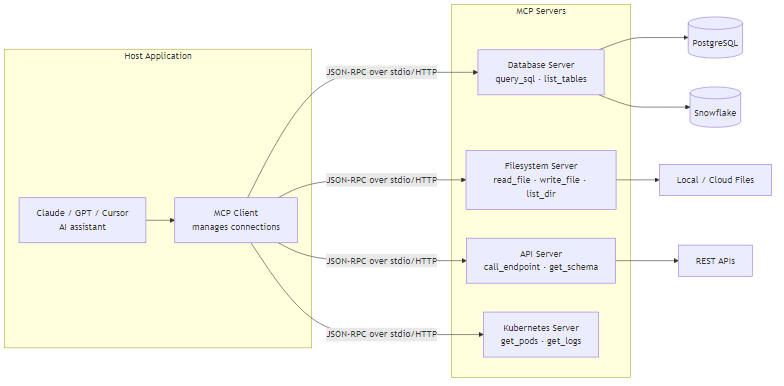

# MCP — Model Context Protocol

## What problem does this solve?
LLMs are isolated from external systems. Every integration (database, file system, API) requires custom prompt engineering, bespoke tool definitions, and non-standardised connection code. The Model Context Protocol (MCP) is an open standard that defines how AI models discover and call external tools and data sources — replacing N custom integrations with one standard interface.

## How it works



### MCP primitives

MCP servers expose three types of primitives:

| Primitive | Description | Example |
|---|---|---|
| **Tools** | Functions the LLM can call (with side effects) | `execute_query`, `write_file`, `send_email` |
| **Resources** | Read-only data sources the LLM can access | Schema definitions, documentation, config files |
| **Prompts** | Pre-built prompt templates with arguments | `generate_dbt_model`, `explain_query` |

### Building an MCP server (Python, FastMCP)

```python
# pip install fastmcp
from fastmcp import FastMCP
from typing import Optional
import snowflake.connector
import pandas as pd

mcp = FastMCP(
    name="snowflake-de-server",
    description="Data engineering tools for Snowflake queries, schema inspection, and profiling"
)

# ─── Tool 1: Execute SQL query ───
@mcp.tool()
def execute_sql(
    query: str,
    warehouse: str = "ANALYTICS_WH",
    max_rows: int = 100
) -> dict:
    """
    Execute a SQL query on Snowflake and return results.
    Use for ad-hoc analysis, debugging, or data validation.
    Always use LIMIT for exploratory queries.

    Args:
        query: SQL query to execute (SELECT only for safety)
        warehouse: Snowflake warehouse to use
        max_rows: Maximum rows to return (default 100)

    Returns:
        Dict with columns, rows, row_count, and execution_time_ms
    """
    if not query.strip().upper().startswith("SELECT"):
        return {"error": "Only SELECT queries are permitted"}

    conn = snowflake.connector.connect(
        account=mcp.config.get("account"),
        user=mcp.config.get("user"),
        authenticator="externalbrowser",
        warehouse=warehouse,
        database="PROD"
    )
    cursor = conn.cursor()
    import time
    start = time.time()
    cursor.execute(query)
    elapsed = int((time.time() - start) * 1000)
    columns = [col[0] for col in cursor.description]
    rows = cursor.fetchmany(max_rows)
    return {
        "columns": columns,
        "rows": [dict(zip(columns, row)) for row in rows],
        "row_count": len(rows),
        "execution_time_ms": elapsed,
        "truncated": len(rows) == max_rows
    }

# ─── Tool 2: Get table schema ───
@mcp.tool()
def get_table_schema(table_name: str, database: str = "PROD") -> dict:
    """
    Get the schema (columns, types, nullability, comments) for a table.
    Use before writing queries to understand the structure.
    table_name format: schema.table_name
    """
    conn = _get_connection()
    cursor = conn.cursor()
    schema, table = table_name.split(".") if "." in table_name else ("PUBLIC", table_name)
    cursor.execute(f"""
        SELECT COLUMN_NAME, DATA_TYPE, IS_NULLABLE, COLUMN_DEFAULT, COMMENT
        FROM {database}.INFORMATION_SCHEMA.COLUMNS
        WHERE TABLE_SCHEMA = '{schema.upper()}'
          AND TABLE_NAME = '{table.upper()}'
        ORDER BY ORDINAL_POSITION
    """)
    columns = cursor.fetchall()
    return {
        "table": f"{database}.{schema}.{table}",
        "columns": [
            {"name": c[0], "type": c[1], "nullable": c[2] == "YES",
             "default": c[3], "comment": c[4]}
            for c in columns
        ]
    }

# ─── Tool 3: Profile a table ───
@mcp.tool()
def profile_table(table_name: str, sample_rate: float = 0.01) -> dict:
    """
    Run data profiling on a table: row count, null rates, distinct counts, min/max.
    Uses sampling for large tables (default 1% sample).
    """
    conn = _get_connection()
    cursor = conn.cursor()
    cursor.execute(f"SELECT COUNT(*) FROM {table_name} SAMPLE ({sample_rate * 100}%)")
    row_count = cursor.fetchone()[0]
    schema = get_table_schema(table_name)
    profile = {"table": table_name, "sampled_row_count": row_count, "columns": {}}
    for col in schema["columns"]:
        col_name = col["name"]
        cursor.execute(f"""
            SELECT
                COUNT(*) AS total,
                COUNT({col_name}) AS non_null,
                COUNT(DISTINCT {col_name}) AS distinct_count,
                MIN({col_name}) AS min_val,
                MAX({col_name}) AS max_val
            FROM {table_name} SAMPLE ({sample_rate * 100}%)
        """)
        row = cursor.fetchone()
        profile["columns"][col_name] = {
            "null_rate": round(1 - row[1] / row[0], 4) if row[0] > 0 else 1.0,
            "distinct_count": row[2],
            "min": str(row[3]),
            "max": str(row[4])
        }
    return profile

# ─── Resource: Table catalog ───
@mcp.resource("snowflake://catalog/tables")
def list_all_tables() -> str:
    """List all tables in PROD with descriptions"""
    conn = _get_connection()
    cursor = conn.cursor()
    cursor.execute("""
        SELECT TABLE_SCHEMA, TABLE_NAME, ROW_COUNT, COMMENT
        FROM PROD.INFORMATION_SCHEMA.TABLES
        WHERE TABLE_TYPE = 'BASE TABLE'
        ORDER BY TABLE_SCHEMA, TABLE_NAME
    """)
    rows = cursor.fetchall()
    result = "# Snowflake PROD Table Catalog\n\n"
    current_schema = None
    for schema, name, rows_count, comment in rows:
        if schema != current_schema:
            result += f"\n## {schema}\n"
            current_schema = schema
        result += f"- **{name}** ({rows_count:,} rows) — {comment or 'No description'}\n"
    return result

# ─── Prompt template ───
@mcp.prompt()
def generate_dbt_model(table_name: str, model_type: str = "incremental") -> str:
    """Generate a dbt model template for a given table"""
    schema = get_table_schema(table_name)
    cols = "\n    ".join(f"{c['name']}," for c in schema["columns"])
    return f"""Create a dbt {model_type} model for {table_name}.

Table schema:
{schema}

Generate:
1. The SQL model file with appropriate config block
2. The YAML schema file with column descriptions and tests
3. A brief description of what this model represents

Follow dbt best practices: use ref() for upstream dependencies,
include not_null and unique tests on primary keys."""

def _get_connection():
    return snowflake.connector.connect(
        account=mcp.config.get("account"),
        user=mcp.config.get("user"),
        authenticator="externalbrowser"
    )

if __name__ == "__main__":
    mcp.run(transport="stdio")  # stdio for Claude Desktop, "sse" for HTTP
```

### MCP server for Delta Lake / Databricks

```python
from fastmcp import FastMCP
from databricks.sdk import WorkspaceClient

mcp = FastMCP("databricks-de-server")
w = WorkspaceClient()

@mcp.tool()
def run_notebook(notebook_path: str, parameters: dict = None) -> dict:
    """Run a Databricks notebook and return the output. Used for triggering pipelines."""
    run = w.jobs.submit(
        run_name="mcp-triggered-run",
        tasks=[{
            "task_key": "run",
            "notebook_task": {
                "notebook_path": notebook_path,
                "base_parameters": parameters or {}
            },
            "new_cluster": {
                "spark_version": "14.3.x-scala2.12",
                "node_type_id": "Standard_DS3_v2",
                "num_workers": 1
            }
        }]
    ).result()
    return {"run_id": run.run_id, "state": run.state.life_cycle_state.value}

@mcp.tool()
def query_delta_table(table_name: str, sql: str) -> dict:
    """Execute SQL against a Unity Catalog table using Databricks SQL Warehouse."""
    from databricks.sdk.service import sql as dbsql
    statement = w.statement_execution.execute_statement(
        statement=sql,
        warehouse_id="your-warehouse-id",
        catalog="prod",
        schema="gold"
    )
    # Poll for result
    while statement.status.state not in ["SUCCEEDED", "FAILED", "CANCELED"]:
        import time; time.sleep(1)
        statement = w.statement_execution.get_statement(statement.statement_id)
    if statement.status.state == "SUCCEEDED":
        cols = [c.name for c in statement.manifest.schema.columns]
        rows = [dict(zip(cols, row.values)) for row in statement.result.data_array]
        return {"columns": cols, "rows": rows}
    return {"error": statement.status.error.message}

@mcp.tool()
def get_pipeline_status(pipeline_name: str) -> dict:
    """Get the current status of a Delta Live Tables pipeline."""
    pipelines = list(w.pipelines.list_pipelines(filter=f"name LIKE '{pipeline_name}%'"))
    if not pipelines:
        return {"error": f"Pipeline '{pipeline_name}' not found"}
    p = pipelines[0]
    return {
        "pipeline_id": p.pipeline_id,
        "name": p.name,
        "state": p.state.value,
        "latest_update": p.latest_updates[0].state.value if p.latest_updates else "no_updates"
    }

if __name__ == "__main__":
    mcp.run(transport="stdio")
```

### Connecting MCP server to Claude Desktop

```json
// ~/.config/claude/claude_desktop_config.json
{
  "mcpServers": {
    "snowflake-de": {
      "command": "python",
      "args": ["/path/to/snowflake_mcp_server.py"],
      "env": {
        "SNOWFLAKE_ACCOUNT": "myaccount.us-east-1",
        "SNOWFLAKE_USER": "engineer@company.com"
      }
    },
    "databricks-de": {
      "command": "python",
      "args": ["/path/to/databricks_mcp_server.py"],
      "env": {
        "DATABRICKS_HOST": "https://myworkspace.azuredatabricks.net",
        "DATABRICKS_TOKEN": "dapi..."
      }
    },
    "filesystem": {
      "command": "npx",
      "args": ["-y", "@modelcontextprotocol/server-filesystem", "/home/user/projects"]
    }
  }
}
```

### Security model for MCP in production

```python
# Production MCP server: always implement auth + rate limiting + audit logging

from fastmcp import FastMCP
from functools import wraps
import jwt, time, logging

mcp = FastMCP("secure-de-server")
audit_log = logging.getLogger("mcp.audit")

def require_auth(f):
    """Validate JWT token before executing tool"""
    @wraps(f)
    def wrapper(*args, _mcp_context=None, **kwargs):
        token = _mcp_context.get("auth_token") if _mcp_context else None
        if not token:
            raise PermissionError("Authentication required")
        try:
            payload = jwt.decode(token, SECRET_KEY, algorithms=["HS256"])
            if payload.get("role") not in ["data_engineer", "admin"]:
                raise PermissionError(f"Role {payload['role']} cannot execute queries")
        except jwt.ExpiredSignatureError:
            raise PermissionError("Token expired")
        return f(*args, **kwargs)
    return wrapper

def audit_tool_call(tool_name: str, args: dict, user: str):
    audit_log.info(json.dumps({
        "timestamp": datetime.utcnow().isoformat(),
        "tool": tool_name,
        "user": user,
        "args": {k: v for k, v in args.items() if k != "password"}
    }))
```

## Real-world scenario

Data engineering team: each engineer writes custom Python scripts to query Snowflake, check pipeline status, and validate data quality. Scripts are inconsistent, undocumented, and not accessible to the AI assistant they're trying to use.

After MCP server:
- One Snowflake MCP server with tools: `execute_sql`, `get_schema`, `profile_table`, `check_freshness`
- One Databricks MCP server with tools: `run_job`, `get_pipeline_status`, `query_delta_table`
- Claude Desktop connected to both
- Engineers now type natural language: "Profile the silver.payments table and tell me if the null rate on merchant_id has changed vs last week" — Claude calls the tools autonomously, compares results, and reports

## What goes wrong in production

- **MCP server with no rate limiting** — LLM agent in a loop calls `execute_sql` 50 times per second, saturating the SQL Warehouse. Add rate limiting per client.
- **Returning too much data** — `execute_sql` returning 100K rows in one response overwhelms the LLM context. Always enforce `max_rows` and flag when truncated.
- **No query validation** — LLM generates a DELETE statement; tool executes it. Validate query type before execution, especially for write operations.
- **Exposing sensitive metadata in tool descriptions** — tool description includes internal IP addresses, credential locations, or data classification. Tool descriptions go into the LLM context; keep them generic.

## References
- [MCP Specification](https://modelcontextprotocol.io/specification)
- [FastMCP Documentation](https://gofastmcp.com/)
- [MCP Python SDK](https://github.com/modelcontextprotocol/python-sdk)
- [Anthropic MCP Introduction](https://www.anthropic.com/news/model-context-protocol)
- [Claude Code MCP Integration](https://docs.claude.ai/en/docs/claude-code/mcp)
