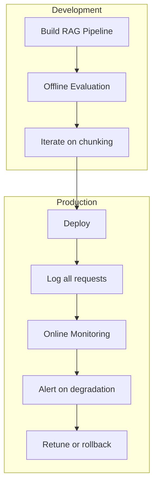

# LLMOps and RAG Evaluation

## What problem does this solve?
An LLM pipeline that looks good in demos can silently degrade in production — retrieval quality drifts as the document corpus grows, hallucination rates increase with edge-case queries, and latency spikes during peak load. LLMOps is the operational practice of measuring, monitoring, and improving LLM-powered pipelines systematically.

## How it works



| Node | Details |
|------|---------|
| **Offline Evaluation** | benchmark dataset |
| **Iterate on chunking** | retrieval, prompts |
| **Log all requests** | + responses + retrievals |
| **Online Monitoring** | latency, cost, quality signals |

### RAG evaluation metrics

**Retrieval metrics (did we fetch the right chunks?):**
- **Context Recall:** Fraction of ground-truth answer found in retrieved chunks. Low = retrieval is missing relevant info.
- **Context Precision:** Fraction of retrieved chunks that are actually relevant. Low = too much noise.
- **MRR (Mean Reciprocal Rank):** Reciprocal of rank of first relevant chunk. Measures whether the best chunk is at top.

**Generation metrics (did the LLM answer well?):**
- **Faithfulness:** Does the answer contain only claims supported by the context? (Hallucination detection)
- **Answer Relevance:** Does the answer actually address the question asked?
- **Answer Correctness:** Is the answer factually correct? (Requires ground truth)

### Offline evaluation with RAGAS

```python
# pip install ragas
from ragas import evaluate
from ragas.metrics import (
    faithfulness,
    answer_relevancy,
    context_recall,
    context_precision,
    answer_correctness
)
from ragas.llms import LangchainLLMWrapper
from datasets import Dataset
from langchain_openai import ChatOpenAI

# Build evaluation dataset
# For each question: ground truth answer + expected context sources
eval_data = [
    {
        "question": "How does Delta Lake handle concurrent writes?",
        "ground_truth": "Delta Lake uses optimistic concurrency control with a transaction log...",
        "contexts": ["Delta Lake uses a transaction log stored as JSON files..."],  # retrieved chunks
        "answer": "Delta Lake handles concurrent writes using optimistic concurrency..."  # LLM answer
    },
    # ... 100+ test cases
]

dataset = Dataset.from_list(eval_data)

# Run evaluation
evaluator_llm = LangchainLLMWrapper(ChatOpenAI(model="gpt-4o"))

result = evaluate(
    dataset=dataset,
    metrics=[
        faithfulness,       # Is the answer grounded in context?
        answer_relevancy,   # Does the answer address the question?
        context_recall,     # Is relevant info in retrieved chunks?
        context_precision,  # Are retrieved chunks relevant?
        answer_correctness  # Is the answer factually correct?
    ],
    llm=evaluator_llm
)

print(result)
# faithfulness: 0.87  (0 = hallucinating, 1 = fully grounded)
# answer_relevancy: 0.92
# context_recall: 0.78  (retrieval misses 22% of relevant info)
# context_precision: 0.65  (35% of retrieved chunks are irrelevant noise)
# answer_correctness: 0.84

# Log results to MLflow for experiment tracking
import mlflow
with mlflow.start_run(run_name="rag-eval-v3-semantic-chunking"):
    mlflow.log_metrics({
        "faithfulness": result["faithfulness"],
        "answer_relevancy": result["answer_relevancy"],
        "context_recall": result["context_recall"],
        "context_precision": result["context_precision"]
    })
    mlflow.log_params({
        "chunk_size": 512,
        "chunk_overlap": 64,
        "top_k": 5,
        "embedding_model": "text-embedding-3-small",
        "chunking_strategy": "semantic"
    })
```

### LLM-as-judge evaluation (custom rubrics)

```python
from openai import OpenAI
from pydantic import BaseModel

client = OpenAI()

class EvaluationResult(BaseModel):
    faithfulness_score: float       # 0-1
    faithfulness_reasoning: str
    completeness_score: float       # 0-1
    completeness_reasoning: str
    hallucination_detected: bool
    hallucinated_claims: list[str]

def evaluate_answer(question: str, context: str, answer: str) -> EvaluationResult:
    """Use LLM to evaluate another LLM's answer — 'LLM as judge' pattern"""
    prompt = f"""You are an expert evaluator for a RAG system. Evaluate the answer below.

QUESTION: {question}

RETRIEVED CONTEXT:
{context}

ANSWER TO EVALUATE:
{answer}

Evaluate on:
1. FAITHFULNESS (0-1): Is every claim in the answer supported by the context? 
   Score 1.0 = fully grounded, 0 = answer contradicts or ignores context.
2. COMPLETENESS (0-1): Does the answer fully address all aspects of the question?
3. HALLUCINATION: List any specific claims in the answer NOT found in the context.

Return JSON only."""

    response = client.chat.completions.create(
        model="gpt-4o",
        messages=[{"role": "user", "content": prompt}],
        response_format={"type": "json_object"},
        temperature=0
    )
    return EvaluationResult(**json.loads(response.choices[0].message.content))
```

### Production observability with LangSmith / Langfuse

```python
# Langfuse: open-source LLM observability (self-hostable)
# pip install langfuse

from langfuse import Langfuse
from langfuse.decorators import observe, langfuse_context

langfuse = Langfuse(
    public_key="pk-...",
    secret_key="sk-...",
    host="https://cloud.langfuse.com"
)

@observe()  # automatically traces this function
def rag_query(question: str, user_id: str) -> dict:
    # Embed question
    langfuse_context.update_current_observation(
        input={"question": question, "user_id": user_id}
    )

    query_embedding = embed_text(question)

    # Retrieve
    results = pinecone_index.query(
        vector=query_embedding, top_k=5, include_metadata=True
    )
    chunks = [r.metadata["text"] for r in results.matches]
    scores = [r.score for r in results.matches]

    # Log retrieval quality signal
    langfuse_context.update_current_observation(
        metadata={
            "retrieval_scores": scores,
            "top_chunk_score": scores[0] if scores else 0,
            "avg_chunk_score": sum(scores) / len(scores) if scores else 0
        }
    )

    # Generate
    context = "\n\n".join(chunks)
    response = openai_client.chat.completions.create(
        model="gpt-4o",
        messages=[
            {"role": "system", "content": f"Answer using this context:\n{context}"},
            {"role": "user", "content": question}
        ]
    )
    answer = response.choices[0].message.content

    # Log token usage for cost tracking
    langfuse_context.update_current_observation(
        usage={
            "input": response.usage.prompt_tokens,
            "output": response.usage.completion_tokens,
            "total": response.usage.total_tokens
        },
        output={"answer": answer}
    )

    return {"answer": answer, "sources": chunks}
```

### Cost monitoring

```python
# Track LLM costs in Delta Lake for chargeback and optimisation
from pyspark.sql import functions as F

# Price per 1M tokens (update as pricing changes)
COST_PER_M_INPUT = {
    "gpt-4o": 2.50,
    "gpt-4o-mini": 0.15,
    "claude-3-5-sonnet": 3.00,
    "text-embedding-3-small": 0.02
}

COST_PER_M_OUTPUT = {
    "gpt-4o": 10.00,
    "gpt-4o-mini": 0.60,
    "claude-3-5-sonnet": 15.00
}

# Store every LLM call in Delta
spark.sql("""
    CREATE TABLE IF NOT EXISTS llm_observability.api_calls (
        call_id         STRING,
        timestamp       TIMESTAMP,
        model           STRING,
        team            STRING,
        use_case        STRING,
        input_tokens    INT,
        output_tokens   INT,
        latency_ms      INT,
        success         BOOLEAN,
        error_message   STRING
    ) USING DELTA
""")

# Daily cost report
spark.sql("""
    SELECT
        team,
        use_case,
        model,
        COUNT(*) AS api_calls,
        SUM(input_tokens) / 1e6 AS input_M_tokens,
        SUM(output_tokens) / 1e6 AS output_M_tokens,
        ROUND(SUM(input_tokens) / 1e6 * model_input_cost
            + SUM(output_tokens) / 1e6 * model_output_cost, 2) AS estimated_cost_usd
    FROM llm_observability.api_calls
    JOIN llm_pricing ON api_calls.model = llm_pricing.model
    WHERE DATE(timestamp) = CURRENT_DATE - 1
    GROUP BY 1, 2, 3
    ORDER BY estimated_cost_usd DESC
""")
```

## Real-world scenario

Internal knowledge base chatbot deployed to 800 employees. No monitoring. After 3 months: engineers discovered via user complaints that the system was confidently answering questions about a deprecated policy (the policy had been updated in Confluence but the RAG index wasn't refreshed).

After LLMOps:
- Langfuse tracing on every query
- Weekly automated RAGAS evaluation on 200-question benchmark
- Context recall alert: if context_recall < 0.75 → trigger reindex
- Faithfulness alert: if faithfulness < 0.80 → page on-call (possible hallucination spike)
- Token cost dashboard per team per week
- Answer thumbs-down button in UI → logged to evaluation dataset for retraining

## What goes wrong in production

- **Eval dataset not maintained** — test questions become stale as the domain changes. Add new questions from real user queries monthly. Filter out questions users get right answers for (not informative for evaluation).
- **Using gpt-4o as judge for gpt-4o answers** — same model evaluating its own outputs introduces bias (the model agrees with itself). Use a different model family as judge, or use human evaluation for critical rubrics.
- **Monitoring retrieval scores but not answer quality** — high retrieval similarity scores don't guarantee good answers. A highly similar chunk can still mislead the LLM. Always monitor both retrieval and generation quality.
- **No cost alerting** — LLM agent runs in a loop due to a bug, generates 10 million tokens in 10 minutes at $10/1M = $100 in 10 minutes. Set per-day spending alerts via your cloud provider + OpenAI/Anthropic billing alerts.

## References
- [RAGAS Documentation](https://docs.ragas.io/)
- [Langfuse Documentation](https://langfuse.com/docs)
- [LangSmith Documentation](https://docs.smith.langchain.com/)
- [Arize Phoenix](https://docs.arize.com/phoenix)
- [LLM Evaluation Survey](https://arxiv.org/abs/2307.03109)
