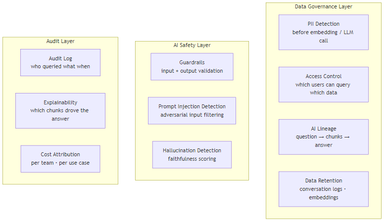

# AI Data Governance and Observability

## What problem does this solve?
AI pipelines introduce new governance challenges not covered by traditional data governance: LLM outputs are probabilistic (not deterministic), prompts can leak sensitive data, embeddings can encode PII, and AI decisions can have regulatory implications. This guide covers governance patterns specifically for AI/LLM data pipelines.

## How it works



### PII handling in AI pipelines

```python
import re
from presidio_analyzer import AnalyzerEngine
from presidio_anonymizer import AnonymizerEngine
from presidio_anonymizer.entities import OperatorConfig

analyzer = AnalyzerEngine()
anonymizer = AnonymizerEngine()

def detect_and_scrub_pii(text: str, entities_to_scrub: list[str] = None) -> tuple[str, list]:
    """
    Detect and scrub PII before sending to embedding API or LLM.
    Returns: (scrubbed_text, list_of_detected_entities)
    """
    if entities_to_scrub is None:
        entities_to_scrub = [
            "PERSON", "EMAIL_ADDRESS", "PHONE_NUMBER", "CREDIT_CARD",
            "IBAN_CODE", "US_SSN", "IP_ADDRESS", "LOCATION", "DATE_TIME"
        ]

    # Detect
    analysis_results = analyzer.analyze(
        text=text,
        entities=entities_to_scrub,
        language="en"
    )

    # Anonymize (replace with placeholder or fake value)
    operators = {
        "PERSON": OperatorConfig("replace", {"new_value": "<PERSON>"}),
        "EMAIL_ADDRESS": OperatorConfig("replace", {"new_value": "<EMAIL>"}),
        "CREDIT_CARD": OperatorConfig("replace", {"new_value": "<CARD_NUMBER>"}),
        "US_SSN": OperatorConfig("replace", {"new_value": "<SSN>"}),
        "PHONE_NUMBER": OperatorConfig("replace", {"new_value": "<PHONE>"})
    }

    anonymized = anonymizer.anonymize(
        text=text,
        analyzer_results=analysis_results,
        operators=operators
    )

    return anonymized.text, [r.entity_type for r in analysis_results]

# Use in RAG indexing pipeline
def safe_embed_and_index(document_text: str, doc_metadata: dict):
    scrubbed_text, detected_pii = detect_and_scrub_pii(document_text)

    if detected_pii:
        # Log PII detection event
        audit_logger.warning(f"PII detected in {doc_metadata['source']}: {detected_pii}")
        # Tag the document in metadata
        doc_metadata["contains_pii"] = True
        doc_metadata["pii_types"] = list(set(detected_pii))

    # Embed scrubbed text
    embedding = embed_text(scrubbed_text)
    return embedding, scrubbed_text, doc_metadata

# Use in query pipeline — scrub user queries before logging
def safe_rag_query(raw_question: str, user_id: str) -> dict:
    scrubbed_question, detected_pii = detect_and_scrub_pii(raw_question)
    if detected_pii:
        audit_logger.info(f"User {user_id} query contained PII: {detected_pii}")

    # Use scrubbed version for logging, original for retrieval
    result = run_rag_pipeline(raw_question)  # use original for best retrieval
    log_query(scrubbed_question, user_id, result)  # log scrubbed version
    return result
```

### Guardrails — input and output validation

```python
# pip install guardrails-ai
import guardrails as gd
from guardrails.hub import DetectPII, RestrictToTopic, ValidJSON

# Input guardrail: block prompt injection and off-topic queries
input_guard = gd.Guard().use_many(
    RestrictToTopic(
        valid_topics=["data engineering", "databricks", "snowflake", "sql", "python"],
        disable_llm=False,  # use LLM to classify topic
        on_fail="exception"
    ),
    DetectPII(
        pii_entities=["EMAIL_ADDRESS", "CREDIT_CARD", "US_SSN"],
        on_fail="fix"  # auto-scrub detected PII
    )
)

# Output guardrail: validate LLM response
output_guard = gd.Guard().use_many(
    ValidJSON(on_fail="reask"),  # for structured extraction
    DetectPII(on_fail="fix")    # scrub PII from LLM outputs
)

def guarded_rag_query(question: str) -> str:
    # Validate and clean input
    validated_input = input_guard.validate(question)

    # Run pipeline
    raw_answer = run_rag_pipeline(validated_input)

    # Validate and clean output
    validated_output = output_guard.validate(raw_answer)
    return validated_output
```

### Multi-tenant RAG: namespace isolation

```python
# In a multi-tenant RAG system, each tenant must see ONLY their own data

class MultiTenantRAG:
    def __init__(self, pinecone_index, embeddings):
        self.index = pinecone_index
        self.embeddings = embeddings

    def query(self, question: str, tenant_id: str, user_roles: list[str]) -> dict:
        """
        Retrieve and answer with strict tenant isolation.
        tenant_id is validated server-side — NEVER trust client-provided tenant_id.
        """
        query_embedding = self.embeddings.embed_query(question)

        # Enforce tenant isolation via Pinecone namespace
        results = self.index.query(
            vector=query_embedding,
            top_k=5,
            namespace=f"tenant_{tenant_id}",  # strict namespace isolation
            filter={
                "access_level": {"$in": user_roles}  # role-based content filtering
            },
            include_metadata=True
        )

        # Double-check: ensure no cross-tenant data in results
        for match in results.matches:
            assert match.metadata.get("tenant_id") == tenant_id, \
                f"SECURITY VIOLATION: cross-tenant data in results for tenant {tenant_id}"

        return self._generate_answer(question, results)

    def index_document(self, text: str, metadata: dict, tenant_id: str):
        """Index a document, always stamping with tenant_id"""
        metadata["tenant_id"] = tenant_id  # always set server-side
        embedding = self.embeddings.embed_query(text)
        self.index.upsert(
            vectors=[{"id": metadata["doc_id"], "values": embedding, "metadata": metadata}],
            namespace=f"tenant_{tenant_id}"
        )
```

### AI lineage: tracing from question to answer

```python
# Store complete lineage for every AI query: question → retrieved chunks → answer
import uuid
from datetime import datetime

def run_rag_with_lineage(question: str, user_id: str, session_id: str) -> dict:
    query_id = str(uuid.uuid4())
    start_time = datetime.utcnow()

    # Embed + retrieve
    q_embedding = embed_text(question)
    retrieval_results = pinecone_index.query(
        vector=q_embedding, top_k=5, include_metadata=True
    )

    chunks = [{
        "chunk_id": r.id,
        "source_doc": r.metadata.get("source_path"),
        "similarity_score": r.score,
        "text_preview": r.metadata.get("text", "")[:200]
    } for r in retrieval_results.matches]

    # Generate answer
    context = "\n\n".join(r.metadata.get("text", "") for r in retrieval_results.matches)
    answer = call_llm(question, context)

    # Calculate faithfulness inline
    faithfulness_score = quick_faithfulness_check(answer, context)

    # Write lineage record
    lineage_record = {
        "query_id": query_id,
        "timestamp": start_time.isoformat(),
        "user_id": user_id,
        "session_id": session_id,
        "question_hash": hashlib.sha256(question.encode()).hexdigest(),
        "question": question,   # store if no PII — scrub first in production
        "retrieved_chunks": json.dumps(chunks),
        "source_documents": [c["source_doc"] for c in chunks],
        "answer_length_chars": len(answer),
        "faithfulness_score": faithfulness_score,
        "latency_ms": int((datetime.utcnow() - start_time).total_seconds() * 1000),
        "model": "gpt-4o",
        "top_chunk_score": retrieval_results.matches[0].score if retrieval_results.matches else 0
    }

    # Append to Delta table
    spark.createDataFrame([lineage_record], lineage_schema) \
        .write.format("delta").mode("append").table("ai_observability.query_lineage")

    return {"answer": answer, "query_id": query_id, "sources": chunks}
```

### Regulatory compliance patterns

```python
# GDPR: right to be forgotten — delete user's data from vector store
def gdpr_delete_user_data(user_id: str):
    """
    Delete all data associated with a user from the RAG system.
    Called when user exercises right to erasure.
    """
    # 1. Delete from vector store
    pinecone_index.delete(
        filter={"uploaded_by_user_id": {"$eq": user_id}}
    )

    # 2. Delete conversation logs from Delta
    spark.sql(f"""
        DELETE FROM ai_observability.query_lineage
        WHERE user_id = '{user_id}'
    """)

    # 3. Delete from document index
    spark.sql(f"""
        DELETE FROM rag.document_index
        WHERE uploaded_by = '{user_id}'
    """)

    # 4. Audit the deletion
    audit_logger.info(json.dumps({
        "event": "gdpr_erasure_completed",
        "user_id": user_id,
        "timestamp": datetime.utcnow().isoformat(),
        "systems_cleared": ["pinecone", "query_lineage", "document_index"]
    }))

# Data retention policy enforcement
spark.sql("""
    DELETE FROM ai_observability.query_lineage
    WHERE timestamp < CURRENT_TIMESTAMP - INTERVAL 90 DAYS
    AND retention_policy = 'standard'
""")
```

## Real-world scenario

Healthcare company building RAG on clinical notes. Regulatory requirements: HIPAA compliance, audit trail for all data access, PHI must not leave the on-premises environment, complete audit trail for 7 years.

Architecture decisions:
- On-premises LLM (Llama 3.1 70B on GPU servers) — no PHI to external API
- pgvector (on-premises PostgreSQL) instead of Pinecone — no PHI to external vector DB
- Presidio for PHI scrubbing before any logging
- Full query lineage in Delta table with 7-year retention
- RBAC: physicians can query all patients, nurses query only assigned patients (row filter on namespace)

## What goes wrong in production

- **Logging raw questions with PII** — user asks "What is the treatment plan for John Smith (DOB 1985-03-15)?" — raw question logged to observability system, now PII is in analytics tables. Always scrub before logging.
- **Shared vector namespace in multi-tenant system** — tenant A's query returns tenant B's confidential documents due to missing namespace isolation. Test cross-tenant isolation explicitly before production launch.
- **Embeddings as a PII vector** — even "anonymised" text can have PII re-identified from embeddings. Treat all embeddings of personal data as PII under GDPR.
- **No retention policy on AI logs** — query lineage table grows unbounded, accumulating years of user queries with potential PII. Define and automate retention policies from day one.

## References
- [Microsoft Presidio](https://microsoft.github.io/presidio/)
- [Guardrails AI](https://www.guardrailsai.com/)
- [OWASP LLM Top 10](https://owasp.org/www-project-top-10-for-large-language-model-applications/)
- [NIST AI RMF](https://www.nist.gov/system/files/documents/2023/01/26/AI_RMF_1_0.pdf)
- [EU AI Act Overview](https://eur-lex.europa.eu/legal-content/EN/TXT/?uri=CELEX:32024R1689)
