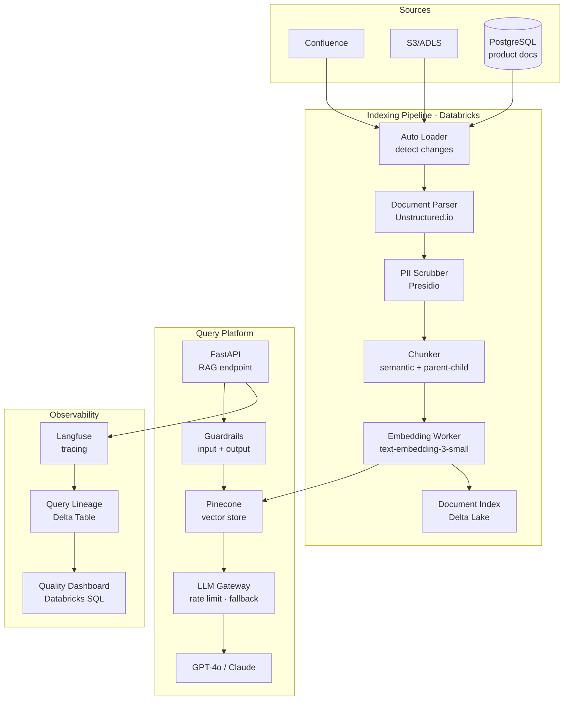
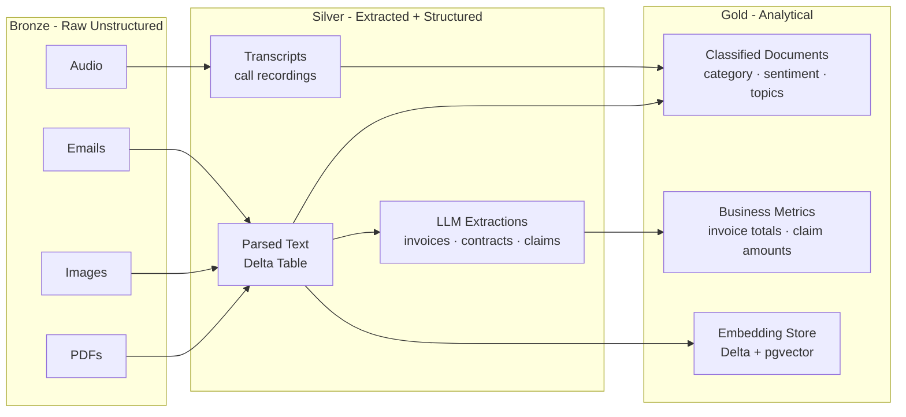
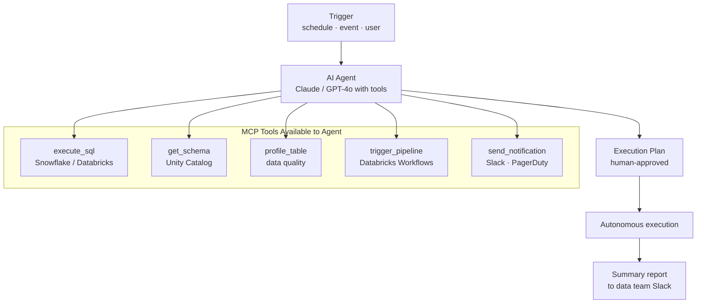
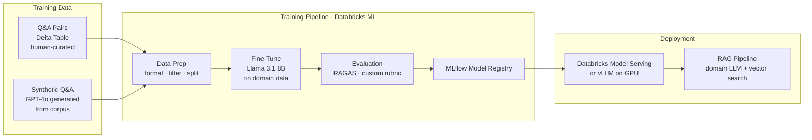

# AI Data Engineering — Reference Architectures

## Architecture 1 — Enterprise RAG Platform



**Key design decisions:**
- Databricks for indexing (parallelise over millions of documents)
- Parent-child chunking: 200-token children for retrieval, 2000-token parents for LLM context
- PII scrubbing before embedding AND before logging
- LLM Gateway (LiteLLM) for model routing, rate limiting, and fallback (GPT-4o → Claude if down)
- Separate evaluation pipeline runs nightly against 200-question benchmark

---

## Architecture 2 — Unstructured Data Lakehouse



**SLA targets:**

| Stage | Latency | Volume |
|---|---|---|
| Bronze landing → Silver parsed | < 30 min | 10K docs/hour |
| Silver → Gold extraction (LLM) | < 2 hours | 10K docs/hour |
| Gold → BI dashboard | < 5 min refresh | - |

---

## Architecture 3 — AI-Augmented Data Pipeline (agentic)



**Use cases:**
- Automated data quality investigation: "silver.payments has 15% null rate spike — investigate root cause and report"
- Pipeline health check: agent queries DLT event log, checks freshness, pings on-call if SLA missed
- Ad-hoc analysis request: business user asks question → agent writes SQL → runs → returns chart

---

## Architecture 4 — Fine-Tuned Domain Model Pipeline



**When to fine-tune vs pure RAG:**

| Situation | Use RAG | Use Fine-tuning |
|---|---|---|
| Private internal knowledge | ✅ (primary use case) | ❌ (data grows, RAG scales) |
| Specific output format/style | ❌ | ✅ (teach the format) |
| Domain terminology / jargon | Use RAG + few-shot | ✅ (learn domain language) |
| Knowledge cutoff issues | ✅ (add new docs to index) | ❌ (static after training) |
| Cost at scale (millions of queries) | Expensive (big context) | ✅ (smaller model + no retrieval) |

---

## Technology Selection Guide

```
Need to serve private documents to users?
└── RAG with vector database

Documents are PDFs/images/audio?
└── Unstructured pipeline (Unstructured.io / Azure DI / Whisper) → RAG

Need AI to interact with your data systems (write SQL, trigger jobs)?
└── MCP server + AI agent

Need to monitor AI pipeline quality and cost?
└── Langfuse / LangSmith + RAGAS evaluation

Storing < 500K vectors on existing Postgres stack?
└── pgvector (no new infra)

Storing > 1M vectors, need < 50ms p99 latency?
└── Pinecone (managed) or Qdrant (self-hosted)

Building on Databricks and need embedded search?
└── Databricks Vector Search (native, no separate vector DB)

Need compliance / audit trail for AI queries?
└── Query lineage in Delta + PII scrubbing + Langfuse
```

## References
- [LiteLLM Gateway](https://docs.litellm.ai/)
- [Databricks Vector Search](https://docs.databricks.com/en/generative-ai/vector-search.html)
- [vLLM for self-hosted LLM serving](https://docs.vllm.ai/)
- [LangChain Production Guide](https://python.langchain.com/docs/guides/productionization/)
